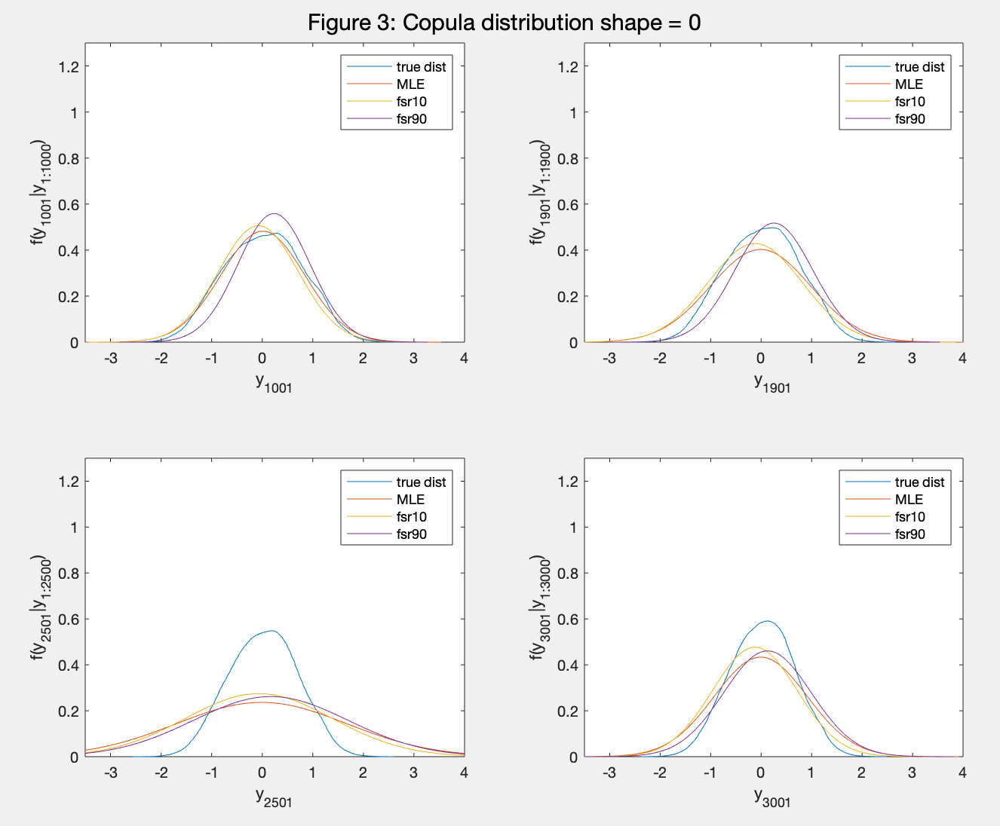
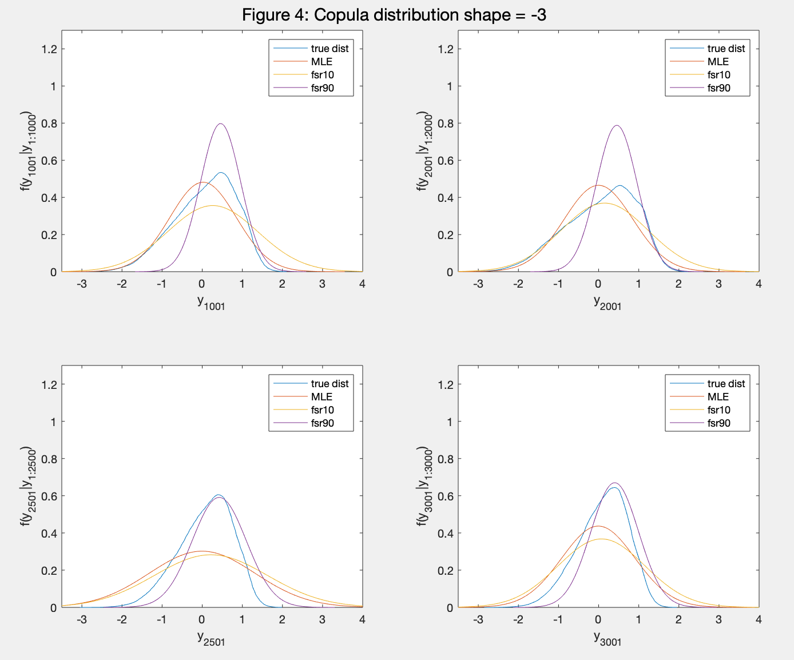
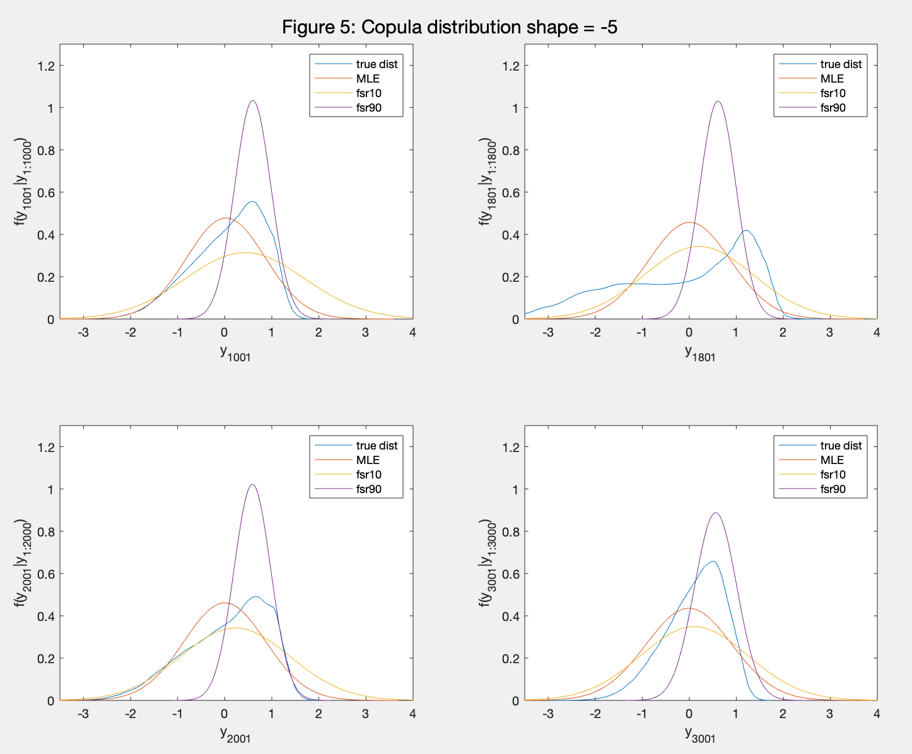
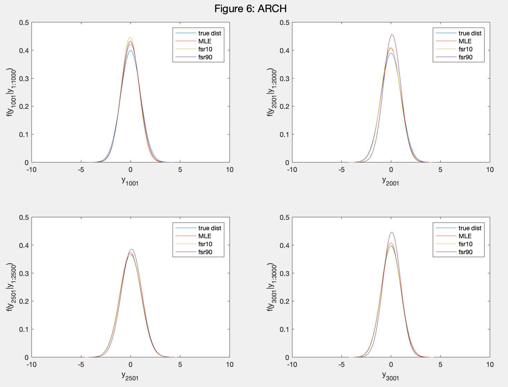
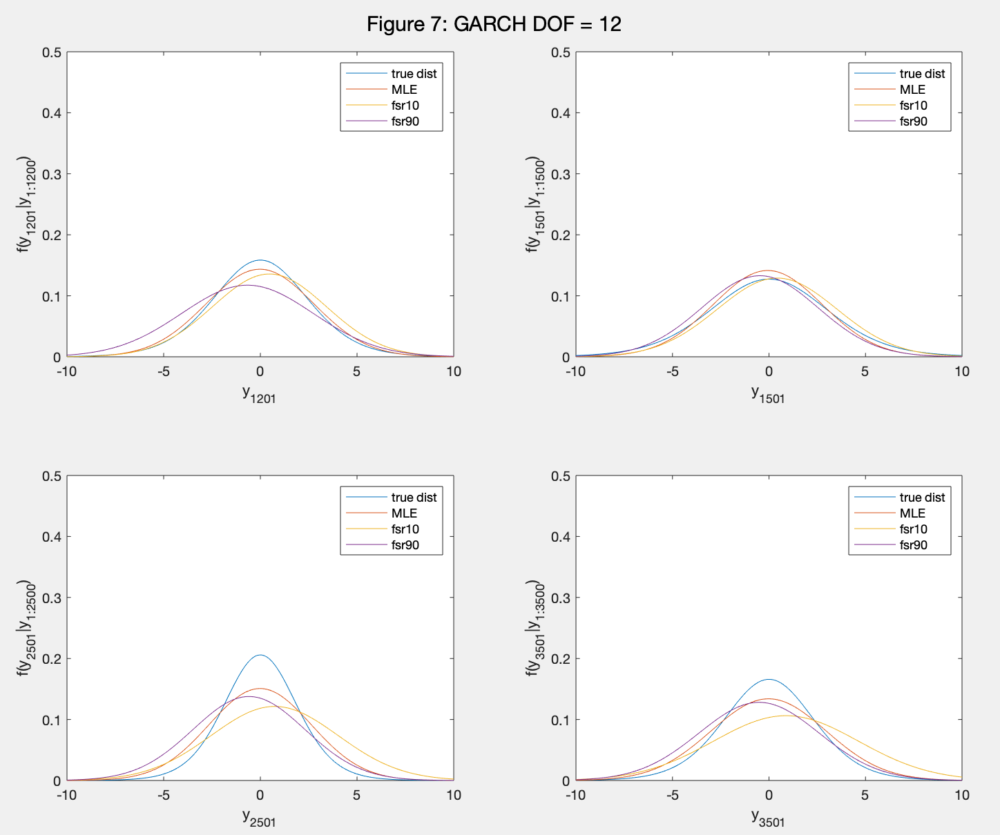
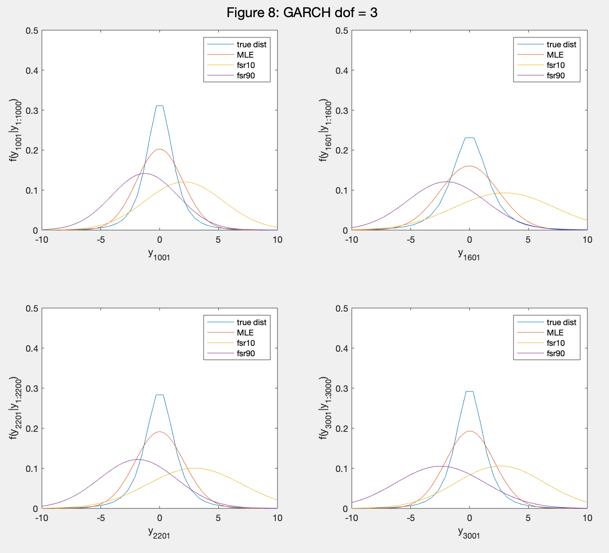

```{r setup, include=FALSE}
knitr::opts_chunk$set(
  echo = FALSE,
  eval = TRUE,
  message = FALSE,
  warning = FALSE)
```


```{r}
knitr::include_graphics("draft cover page.pdf")
```

\pagebreak

```{r, message=FALSE}
library(formattable)
library(dplyr)
library(tidyverse)
library(ggplot2)
library(tsibble)
library(tsibbledata)
library(feasts)
library(normtest)
library(moments)
library(ggthemes)
library(ggpubr)
library(knitr)
library(kableExtra)
```

# Abstract 

\pagebreak

# 1. Introduction

# 2. Scoring rule in prediction
## 2.1 Overview and notation 

Scoring rules can be used in both estimation and prediction. In estimation, an optimum estimator $\hat \theta$ can be obtained by maximizing a scoring rule $S_n$. That is, $\hat \theta_n=arg \max_\theta S_n(\theta)$. $\hat \theta \to \theta$ as $n \to \infty$ under asymptotic situations. While in prediction, scoring rules assign a numerical value to density forecasts, addressing both sharpness and calibration. For a positively oriented score, higher value will be assigned to a better forecast between two competing candidates. A variety of proper scoring rules allows users to produce probability predictions based on their interests, and to compare these predictions, as long as they refer to the same forecast quantity. Forecasts candidates are often compared by their average scores. Therefore, the crucial importance of the propreity of scoring rules must be emphasized.Gneiting & Raftery, (2007) illustrate the importance of propreity via a case study in weather forecasts and point out that improper scoring rules will assign higher average score to an incorrect density forecast. A scoring rule is said to be proper if $S(Q,Q) \geq S(P,Q)$ for all P and Q, and it is strictly proper if $S(Q,Q) = S(P,Q)$ only happens when P = Q. P and Q are predictive distributions and Q is the best forecast given all the available information. S(P,Q) means the expected value of S(P,$\cdot$) under Q (Gneiting & Raftery, 2007). 

Some commonly used proper scoring rules are the logarithmic score (LS), the continuously ranked probability score (CRPS) and censored likelihood score (CSL) or focused score (FSR) in a sense that CSL is used for focusing on a certain region(s) of densities. 

The logarithmic score is defined as (1) where $p_t$ is the density forecasts. It is a local strictly proper scoring rule, which means it will assign a higher score to the correct probabilistic forecast, and it is superior to quadratic and spherical scoring rules when the rank ordering is important or the impact of nonlinear utility function used is a concern for forecasters (Bickel, 2007). 
\begin{align}
S_{LS}(p_t, y_{t+1}) = log[p_t(y_{t+1})]
\end{align}
However, logarithmic score is criticized by its unboundness and its local property. Its useness is also questioned in (Bernardo, 1979), since he shows that every proper scoring rule is equivalent to logarithmic score. Gneiting & Raftery, (2007) argue that logarithmic score is insensitive to distance and will not reward predictions that are close to but not identical to the materialized one. Therefore, Gneiting & Raftery, (2007) propose the continuously ranked probability score, which is sensitive to distance and is defined as in (2) where P is the cumulative distriubtion function, I is the indication function, and x is the materialized events. 

\begin{align}
CRPS(P,x)=-\int_{-\infty}^{\infty}(P(y)-I(y\geq x))^2dy
\end{align}

The formula can be simplifed to (3) if the prediction distribution is Gaussian with mean = $\mu$ and variance = $\sigma^2$.
\begin{align}
CRPS(N,x)=\sigma[\frac{1}{\sqrt{\pi}}-2\phi(\frac{x-\mu}{\sigma})-\frac{x-\mu}{\sigma}(2\Phi(\frac{x-\mu}{\sigma})-1)]
\end{align}
where $\phi$ and $\Phi$ are the probability density function and cumulative density function of the Gaussian predictive distribution.

Continuously ranked probability score is defined as a negatively oriented scoring rule, but it can be easily transformed to positively oriented score for convenient comparison among scoring rules as shown in (4). 

\begin{align}
CRPS^*(N,x)=\sigma[-\frac{1}{\sqrt{\pi}}+2\phi(\frac{x-\mu}{\sigma})+\frac{x-\mu}{\sigma}(2\Phi(\frac{x-\mu}{\sigma})-1)]
\end{align}

Both logarithmic score and continuously ranked probability score are used for producing and evaluating the entire predictive density. In terms of accurately predicting a certain region of a distribution, they are typically used together with weighted likelihood (Gneiting & Ranjan, 2011). Diks, Panchenko & van Dijk, (2011) propose a new proper scoring rule, censored likelihood score, which allows users to assess the forecasts only in the interested region(s) instead of using weights to emphasize a particular part of the entire density forecast. It is defined as in (5) where $p_t$ is the predictive probability density function, $A_t$ is the interested region(s) and $A_t^c$ is the complement of $A_t$.

\begin{align}
S_{CSL}(p_t, y_{t+1})=I(y_{t+1} \in A_t)log[ p_t(y_{t+1})]+I(y_{t+1} \in A_t^c)log[\int_{A_t^c} p_t(s)ds]
\end{align}

[ref 5] prove that weighted density forecasts based on optimizing the censored likelihood score outperform those on logarithmic score and continuously ranked probability score. 

## 2.2 Illustration example 
### 2.2.1 Simulation overview 

Density forecasts provide more complete information of uncertainty of a prediction than point and interval forecasts. Moreover, the tails of a density have a great importance in finance. It forms the foundation of risk management, such as Value-at-Risk (VaR), and asset allocation. It can also be used in derivatives pricing. (reference ?) --- find some papers. 

[ref 5] provide empirical results showing that using censored likelihood score can improve 99% Value-at-Risk estimation. Moreover, Loaiza-Maya, Martin & Frazier, (2019) propose a new method, Focused Bayes, in Bayeisian prediction by replacing the conventional likelihood function with the censored likelihood score. Their results show that Focused Bayes outperform exact Bayes which is using logarithmic score for updating the prior probability. Their work also points out the degree of model misspecification play a role in the performance of Focused Bayes. 

Loaiza-Maya et al., (2020) extend the above discussion to frequentist probability forecasting. They address questions about when we can/cannot benefit from optimal probabilistic forecasts out of sample. A predictive probability distribution is said to be optimal if it is optimal based on a user-specified scoring rule, not generally speaking. 

Building on the previous research in this field, we conduct a numerical analysis first in section 2.2.2 and 2.2.3 to further investigate the effects of the form and degree of model misspecification on optimal forecast performance using data simulated from the (generalized) autoregressive conditional heteroscedasticity ((G)ARCH) and copula models.

### 2.2.2 Simulation design 

In order to prepare the financial application analysis in following sections of this paper, we simulate a time series dependnet variable $y_t$ that mimic the behavior of financial returns and volatility. Specifically, GARCH models can capture the volatility clustering and serial dependence, and the negative marginal skewness will be introducted using an inversion copula with degree of skewness controlled by the shape parameter showed below. In order to manipulate the degree and form of model misspecification, we fix the underlying model to a simple and clearly misspecified ARCH(1) model.

Specific simulation scenarios are listed as follows ($t_\nu$ indicates a Student-t distribution with $\nu$ degrees of freedom): 

\begin{table}[!h]
\centering
\begin{tabular}{|c|c|c|}
\hline
          & \textbf{Scenario (i)} & \textbf{Scenario (ii)} \\ \hline
\textbf{True DGP} & $y_t = \sigma_t \epsilon_t$ & copula \\
& $\sigma_t^2 = 1 + 0.2y_{t-1}^2+0.7\sigma_{t-1}^2$ & Shape parameter = {0, -3, -5}\\ & $\epsilon_t \sim (\frac{\nu-2}{\nu})^0.5 * t_\nu$ & \\ & $\nu \in (3, 12, 10000)$ & \\ \hline

\textbf{Assumed Model} & $y_t = \sigma_t \epsilon_t$ & $y_t = \sigma_t \epsilon_t$\\ & $\sigma_t^2 = 1 + 0.2y_{t-1}^2+0.7\sigma_{t-1}^2$ & $\sigma_t^2 = 1 + 0.2y_{t-1}^2+0.7\sigma_{t-1}^2$\\ & $\epsilon_t \sim N(0,1)$ & $\epsilon_t \sim N(0,1)$\\ \hline
\end{tabular}
\end{table}

The methodology in Loaiza-Maya et al., (2020) and Loaiza-Maya, Martin & Frazier, (2019) is adopted. We conduct each simulation scenario as follows (Loaiza-Maya et al., 2020): 

  1.	Generate T = 6000 observations for $y_t$ from the true DGP
  
  2.	Use $y_{1:1000}$ to estimate $\hat \theta$ in the assumed predictive model based on the positively-oriented score $S_i$

\begin{align}
{\hat \theta^{[i]}}:=arg\max_{\theta \in \Theta}\bar S_i({\theta})
\end{align}

\begin{align}
\bar S_i(\theta):=\frac{1}{T-(\tau+1)}\sum^{T-\tau}_{t=2}S(P_{\theta}^{t-1},y_t)
\end{align}

  3.	Produce the one-step-ahead predictive $P^{t-1}_{\hat \theta_1^{[i]}}$ And compute the out-of-sample score using $S_j$, where $S_i$ and $S_j$ refer to (?)(?)(?)

....

### 2.2.3 Simulation results

```{r}
# Editting the matlab written csv files 

GARCH_t12 <- read.csv("GARCH_t12__table.csv")
GARCH_t12 <- rename(GARCH_t12, "In-sample optimizers" = Row, "FSR10" = FSR10, "FSR20"=FSR20, "FSR80"=FSR80,"FSR90"=FSR90)
GARCH_t12$`In-sample optimizers`<-c("LS","CRPS","FSR10","FSR20","FSR80","FSR90")

GARCH_t3 <- read.csv("GARCH_t3_table.csv")
GARCH_t3 <- rename(GARCH_t3, "In-sample optimizers" = Row, "FSR10" = FSR10, "FSR20"=FSR20, "FSR80"=FSR80,"FSR90"=FSR90)
GARCH_t3$`In-sample optimizers`<-c("LS","CRPS","FSR10","FSR20","FSR80","FSR90")

ARCH_table <- read.csv("ARCH_table.csv")
ARCH_table <- rename(ARCH_table, "In-sample optimizers" = Row, "FSR10" = FSR10, "FSR20"=FSR20, "FSR80"=FSR80,"FSR90"=FSR90)
ARCH_table$`In-sample optimizers`<-c("LS","CRPS","FSR10","FSR20","FSR80","FSR90")

Copula5_table <- read.csv("Copula5_table.csv")
Copula5_table <- rename(Copula5_table, "In-sample optimizers" = Row, "FSR10" = FSR10, "FSR20"=FSR20, "FSR80"=FSR80,"FSR90"=FSR90)
Copula5_table$`In-sample optimizers`<-c("LS","CRPS","FSR10","FSR20","FSR80","FSR90")

Copula3_table <- read.csv("Copula3_table.csv")
Copula3_table <- rename(Copula3_table, "In-sample optimizers" = Row, "FSR10" = FSR10, "FSR20"=FSR20, "FSR80"=FSR80,"FSR90"=FSR90)
Copula3_table$`In-sample optimizers`<-c("LS","CRPS","FSR10","FSR20","FSR80","FSR90")

Copula0_table <- read.csv("Copula0_table.csv")
Copula0_table <- rename(Copula0_table, "In-sample optimizers" = Row, "FSR10" = FSR10, "FSR20"=FSR20, "FSR80"=FSR80,"FSR90"=FSR90)
Copula0_table$`In-sample optimizers`<-c("LS","CRPS","FSR10","FSR20","FSR80","FSR90")

```


```{r}
ARCH_table %>% 
  mutate(
    LS = cell_spec(format(LS,4),"latex",bold = ifelse(LS == max(LS),TRUE,FALSE)),
    CRPS = cell_spec(format(CRPS,4),"latex",bold = ifelse(CRPS==max(CRPS),TRUE,FALSE)),
    `FSR10` = cell_spec(format(`FSR10`,4),"latex",bold = ifelse(`FSR10`==max(`FSR10`),TRUE,FALSE)),
    `FSR20` = cell_spec(format(`FSR20`,4),"latex",bold = ifelse(`FSR20`==max(`FSR20`),TRUE,FALSE)),
    `FSR80` = cell_spec(format(`FSR80`,4),"latex",bold = ifelse(`FSR80`==max(`FSR80`),TRUE,FALSE)),
    `FSR90` = cell_spec(format(`FSR90`,4),"latex",bold = ifelse(`FSR90`==max(`FSR90`),TRUE,FALSE))
  ) %>%
  kable("latex",escape = F, booktabs = T, linesep = "") %>%
  kable_styling("bordered",full_width = F)%>%
  add_header_above(c("","Average out-of-sample scores"=6)) %>% 
  add_header_above(c("Table 1: the true DGP is ARCH(1)"=7))
```

```{r}
GARCH_t12 %>% 
  mutate(
    LS = cell_spec(format(LS,4),"latex",bold = ifelse(LS == max(LS),TRUE,FALSE)),
    CRPS = cell_spec(format(CRPS,4),"latex",bold = ifelse(CRPS==max(CRPS),TRUE,FALSE)),
    `FSR10` = cell_spec(format(`FSR10`,4),"latex",bold = ifelse(`FSR10`==max(`FSR10`),TRUE,FALSE)),
    `FSR20` = cell_spec(format(`FSR20`,4),"latex",bold = ifelse(`FSR20`==max(`FSR20`),TRUE,FALSE)),
    `FSR80` = cell_spec(format(`FSR80`,4),"latex",bold = ifelse(`FSR80`==max(`FSR80`),TRUE,FALSE)),
    `FSR90` = cell_spec(format(`FSR90`,4),"latex",bold = ifelse(`FSR90`==max(`FSR90`),TRUE,FALSE))
  ) %>%
  kable("latex",escape = F, booktabs = T, linesep = "") %>%
  kable_styling("bordered",full_width = F)%>%
  add_header_above(c("","Average out-of-sample scores"=6)) %>% 
  add_header_above(c("Table 2: the true DGP is GARCH(1,1) with degree of freedom = 12"=7))
```


```{r}
GARCH_t3 %>% 
  mutate(
    LS = cell_spec(format(LS,4),"latex",bold = ifelse(LS == max(LS),TRUE,FALSE)),
    CRPS = cell_spec(format(CRPS,4),"latex",bold = ifelse(CRPS==max(CRPS),TRUE,FALSE)),
    `FSR10` = cell_spec(format(`FSR10`,4),"latex",bold = ifelse(`FSR10`==max(`FSR10`),TRUE,FALSE)),
    `FSR20` = cell_spec(format(`FSR20`,4),"latex",bold = ifelse(`FSR20`==max(`FSR20`),TRUE,FALSE)),
    `FSR80` = cell_spec(format(`FSR80`,4),"latex",bold = ifelse(`FSR80`==max(`FSR80`),TRUE,FALSE)),
    `FSR90` = cell_spec(format(`FSR90`,4),"latex",bold = ifelse(`FSR90`==max(`FSR90`),TRUE,FALSE))
  ) %>%
  kable("latex",escape = F, booktabs = T, linesep = "") %>%
  kable_styling("bordered",full_width = F)%>%
  add_header_above(c("","Average out-of-sample scores"=6)) %>% 
  add_header_above(c("Table 3: the true DGP is GARCH(1,1) with degree of freedom = 3"=7))
```


```{r}

Copula0_table %>% 
  mutate(
    LS = cell_spec(format(LS,4),"latex",bold = ifelse(LS == max(LS),TRUE,FALSE)),
    CRPS = cell_spec(format(CRPS,4),"latex",bold = ifelse(CRPS==max(CRPS),TRUE,FALSE)),
    `FSR10` = cell_spec(format(`FSR10`,4),"latex",bold = ifelse(`FSR10`==max(`FSR10`),TRUE,FALSE)),
    `FSR20` = cell_spec(format(`FSR20`,4),"latex",bold = ifelse(`FSR20`==max(`FSR20`),TRUE,FALSE)),
    `FSR80` = cell_spec(format(`FSR80`,4),"latex",bold = ifelse(`FSR80`==max(`FSR80`),TRUE,FALSE)),
    `FSR90` = cell_spec(format(`FSR90`,4),"latex",bold = ifelse(`FSR90`==max(`FSR90`),TRUE,FALSE))
  ) %>%
  kable("latex",escape = F, booktabs = T, linesep = "") %>%
  kable_styling("bordered",full_width = F)%>%
  add_header_above(c("","Average out-of-sample scores"=6)) %>% 
  add_header_above(c("Table 4: the true DGP is copula with shape parameter = 0"=7))
```


```{r}
Copula3_table %>% 
  mutate(
    LS = cell_spec(format(LS,4),"latex",bold = ifelse(LS == max(LS),TRUE,FALSE)),
    CRPS = cell_spec(format(CRPS,4),"latex",bold = ifelse(CRPS==max(CRPS),TRUE,FALSE)),
    `FSR10` = cell_spec(format(`FSR10`,4),"latex",bold = ifelse(`FSR10`==max(`FSR10`),TRUE,FALSE)),
    `FSR20` = cell_spec(format(`FSR20`,4),"latex",bold = ifelse(`FSR20`==max(`FSR20`),TRUE,FALSE)),
    `FSR80` = cell_spec(format(`FSR80`,4),"latex",bold = ifelse(`FSR80`==max(`FSR80`),TRUE,FALSE)),
    `FSR90` = cell_spec(format(`FSR90`,4),"latex",bold = ifelse(`FSR90`==max(`FSR90`),TRUE,FALSE))
  ) %>%
  kable("latex",escape = F, booktabs = T, linesep = "") %>%
  kable_styling("bordered",full_width = F)%>%
  add_header_above(c("","Average out-of-sample scores"=6)) %>% 
  add_header_above(c("Table 5: the true DGP is copula with shape parameter = -3"=7))
```


```{r}
Copula5_table %>% 
  mutate(
    LS = cell_spec(format(LS,4),"latex",bold = ifelse(LS == max(LS),TRUE,FALSE)),
    CRPS = cell_spec(format(CRPS,4),"latex",bold = ifelse(CRPS==max(CRPS),TRUE,FALSE)),
    `FSR10` = cell_spec(format(`FSR10`,4),"latex",bold = ifelse(`FSR10`==max(`FSR10`),TRUE,FALSE)),
    `FSR20` = cell_spec(format(`FSR20`,4),"latex",bold = ifelse(`FSR20`==max(`FSR20`),TRUE,FALSE)),
    `FSR80` = cell_spec(format(`FSR80`,4),"latex",bold = ifelse(`FSR80`==max(`FSR80`),TRUE,FALSE)),
    `FSR90` = cell_spec(format(`FSR90`,4),"latex",bold = ifelse(`FSR90`==max(`FSR90`),TRUE,FALSE))
  ) %>%
  kable("latex",escape = F, booktabs = T, linesep = "") %>%
  kable_styling("bordered",full_width = F)%>%
  add_header_above(c("","Average out-of-sample scores"=6)) %>% 
  add_header_above(c("Table 6: the true DGP is copula with shape parameter = -5"=7))
```

# Score trace for simulation 

```{r, out.width="600px",fig.align='center'}
knitr::include_graphics("figure 1.pdf")
```

```{r, out.width="600px",fig.align='center'}
# knitr::include_graphics("figure 2.pdf")
```

# Probabilistic density over time 
### 6.1.3 Predictive Densities

The predictive density plots provide a straightforward way to visualize how optimal probabilistic forecast matches the shape of true DGP distribution at different time.

```{r, out.width="600px"}

```

```{r, out.width="600px"}

```

```{r, out.width="600px"}

```

```{r, out.width="600px"}

```

```{r, out.width="600px"}

```

```{r, out.width="600px"}

```

# Value-at-Risk 
```{r, eval=False}
copula5var <- read.csv("copula5var.csv")

VaR0.1 <- as.numeric(copula5var[,c(1,5,9,13,17,21)])
VaR0.2 <- as.numeric(copula5var[,c(2,6,10,14,18,22)])
VaR0.8 <- as.numeric(copula5var[,c(3,7,11,15,19,23)])
VaR0.9 <- as.numeric(copula5var[,c(4,8,12,16,20,24)])

Optimizers <- c("LS","CRPS","FSR10","FSR20","FSR80","FSR90")

df <- data.frame(Optimizers,VaR0.1,VaR0.2,VaR0.8,VaR0.9)
# df <- rename(df,"VaR at 10%"=VaR0.1, "VaR at 20%"=VaR0.2, "VaR at 80%"=VaR0.8, "VaR at 90%"=VaR0.9)

df %>% 
  mutate(
    `VaR0.1` = cell_spec(format(`VaR0.1`,4),"latex",bold = ifelse(abs(`VaR0.1`-0.1) == min(abs(`VaR0.1`-0.1)),TRUE,FALSE)),
    `VaR0.2` = cell_spec(format(`VaR0.2`,4),"latex",bold = ifelse(abs(`VaR0.2`-0.2) == min(abs(`VaR0.2`-0.2)),TRUE,FALSE)),
    `VaR0.8` = cell_spec(format(`VaR0.8`,4),"latex",bold = ifelse(abs(`VaR0.8`-0.8) == min(abs(`VaR0.8`-0.8)),TRUE,FALSE)),
    `VaR0.9` = cell_spec(format(`VaR0.9`,4),"latex",bold = ifelse(abs(`VaR0.9`-0.9) == min(abs(`VaR0.9`-0.9)),TRUE,FALSE))
  ) %>%
  kable("latex",escape = F, booktabs=T, linesep = "") %>%
  kable_styling("bordered",full_width = F) %>%
  add_header_above(c(" ","Out-of-sample exceedances"=4)) %>%
  add_header_above(c("Table 7: Value-at-Risk when true DGP is copula (shape = -5)"=5))
```


```{r, eval=False}
garch3var <- read.csv("garch3var.csv")

VaR0.1 <- as.numeric(garch3var[,c(1,5,9,13,17,21)])
VaR0.2 <- as.numeric(garch3var[,c(2,6,10,14,18,22)])
VaR0.8 <- as.numeric(garch3var[,c(3,7,11,15,19,23)])
VaR0.9 <- as.numeric(garch3var[,c(4,8,12,16,20,24)])

df <- data.frame(Optimizers,VaR0.1,VaR0.2,VaR0.8,VaR0.9)
df <- rename(df,"VaR at 10%"=VaR0.1, "VaR at 20%"=VaR0.2, "VaR at 80%"=VaR0.8, "VaR at 90%"=VaR0.9)

df %>% 
  mutate(
    `VaR0.1` = cell_spec(format(`VaR0.1`,4),"latex",bold = ifelse(abs(`VaR0.1`-0.1) == min(abs(`VaR0.1`-0.1)),TRUE,FALSE)),
    `VaR0.2` = cell_spec(format(`VaR0.2`,4),"latex",bold = ifelse(abs(`VaR0.2`-0.2) == min(abs(`VaR0.2`-0.2)),TRUE,FALSE)),
    `VaR0.8` = cell_spec(format(`VaR0.8`,4),"latex",bold = ifelse(abs(`VaR0.8`-0.8) == min(abs(`VaR0.8`-0.8)),TRUE,FALSE)),
    `VaR0.9` = cell_spec(format(`VaR0.9`,4),"latex",bold = ifelse(abs(`VaR0.9`-0.9) == min(abs(`VaR0.9`-0.9)),TRUE,FALSE))
  ) %>%
  kable("latex",escape = F, booktabs=T, linesep = "") %>%
  kable_styling("bordered",full_width = F) %>%
  add_header_above(c(" ","Out-of-sample exceedances"=4)) %>%
  add_header_above(c("Table 8: Value-at-Risk when true DGP is GARCH(1,1) with degree of freedom = 3"=5))
```

The values showed in these tables refer to the proportion of exceedances over the value at risk indicated by the column. Thus, the closer the values to nominal VaR levels, the more accurate are the optimal predictions. We can see that in two different forms of model misspecification, FSR is strictly superior to other scores in the upper tails, while in the lower tails, the difference is quite small when not strictly preferable. This result helps us understand what to expect in practical VaR analysis. 

# Empirical Analysis
## S&P500

```{r}
# data cleaning and import 
sp <- read.csv("^GSPC.csv")
sp <- sp %>% dplyr::select("Date","Adj.Close")

sp$log.returns <- c(NA,diff(log(sp$Adj.Close)))
logret <- sp[-c(1:41),c(1,3)] # delete the adjusted price col, only keep 6000 obs

# export the dataset to csv. including only trading days and log returns 
temp <- logret[,c(2)]
temp <- data.frame(temp)
write_csv(temp,"sp500log.csv")
```


```{r, results='hide'}
# descriptive statistics 
summary(logret$log.returns) # ----> need to be tabulated 
range(logret$log.returns)
# some test results aginst normal dist h_null
# JB test
jb.norm.test(logret$log.returns)
# Ljung box test
Box.test(logret$log.returns,lag = 2,type = "Lj",fitdf = 1)

skewness(logret$log.returns)
kurtosis(logret$log.returns)
```


```{r}
sum <- data.frame(Stock="S&P500",Min=-0.1276522,Median=0.0006105,Mean=0.0002453,Max=0.1095720,Skewness= -0.3807978,Kurtosis=13.5123,JB.Test=27772,LB.Test=60.627)
sum %>% 
  kable("latex",booktabs = T) %>% 
  kable_styling("bordered") %>% 
  add_header_above(c("Table ?: Descriptive statistics"=9))
```


```{r,message=FALSE,fig.align='center'}

# time series plot
logret$Date <- as.Date(logret$Date,format = "%Y-%m-%d")

logret %>% ggplot(aes(x = Date, y = log.returns)) +
  geom_line()+theme_classic()+labs(x="Year",y="Daily log returns")+
  ggtitle("Figure 9: S&P500 daily log returns")+
  scale_x_date(date_breaks = "years",date_labels = "%y")+
  scale_y_continuous(labels = scales::percent) + 
  annotate(geom = 'text',x=as.Date("2008-09-18"),y=-0.12,label="Global Financial Crisis",color="red",size=3)+
  annotate(geom = 'text',x=as.Date("2020-04-01"),y=-0.12,label="COVID-19",color="red",size=2)+
  theme_clean()+
  labs(caption = "Figure 9: the time series plot of S&P500 daily log returns")

# histogram plots
logret %>% ggplot()+geom_histogram(aes(x=log.returns))+xlim(-0.13,0.13)+ggtitle("Figure 10")+
  scale_x_continuous(labels = scales::percent)+theme_clean()+
  labs(caption = "Figure 10: the distribution of S&P500 log returns is asymmetric")

# ACF plots to see the autocorrelation 
logret <- logret %>% 
  mutate(trading_day = row_number()) %>%
  as_tsibble(index = trading_day,regular = TRUE)

logret %>% ACF((log.returns)^2) %>% autoplot() + ggtitle("Figure 11:Squared log returns autocorrelation")+xlab("number of lags")+ylab("ACF")+theme_clean()+labs(caption = "Figure 11: the autocorrelation plot shows there is a strong serial correlation in volatility of S&P500")
```

##### Average scores 

```{r}
sp_table <- read.csv("sp_table.csv")
sp_table <- rename(sp_table, "In-sample optimizers" = Row,"FSR10" = FSR10, "FSR20"=FSR20, "FSR80"=FSR80,"FSR90"=FSR90)
sp_table$`In-sample optimizers`<-c("LS","CRPS","FSR10","FSR20","FSR80","FSR90")

sp_table %>% 
  mutate(
    LS = cell_spec(format(LS,4),"latex",bold = ifelse(LS == max(LS),TRUE,FALSE)),
    CRPS = cell_spec(format(CRPS,4),"latex",bold = ifelse(CRPS==max(CRPS),TRUE,FALSE)),
    `FSR10` = cell_spec(format(`FSR10`,4),"latex",bold = ifelse(`FSR10`==max(`FSR10`),TRUE,FALSE)),
    `FSR20` = cell_spec(format(`FSR20`,4),"latex",bold = ifelse(`FSR20`==max(`FSR20`),TRUE,FALSE)),
    `FSR80` = cell_spec(format(`FSR80`,4),"latex",bold = ifelse(`FSR80`==max(`FSR80`),TRUE,FALSE)),
    `FSR90` = cell_spec(format(`FSR90`,4),"latex",bold = ifelse(`FSR90`==max(`FSR90`),TRUE,FALSE))
  ) %>%
  kable("latex",escape = F, booktabs = T, linesep = "") %>%
  kable_styling("bordered",full_width = F)%>%
  add_header_above(c("","Average out-of-sample scores"=6)) %>% 
  add_header_above(c("Table 9: Average scores for S&P500"=7))
```

The average score table, similar to simulation analysis, is produced for daily logarithmic returns of S&P500. For example, in column 4 (FSR10), a focused score at 10% will produce the optimal prediction in terms of forecasting the 10% tail of the returns’ distribution. The results in this table indicate that we expect to gain considerably from optimal probabilistic forecasts in practice. 

##### Score traces 

```{r,fig.width=10,fig.height=5}
# to compress all the calculated plotting average scores together in the same df 
trace_fsr10 <- read.csv("fsr10.csv")
trace_fsr20 <- read.csv("fsr20.csv")
trace_10ls <- read.csv("fsr10_ls.csv")
trace_10crps <- read.csv("fsr10_crps.csv")

fsr10 <- data.frame(trace_fsr10,trace_fsr20,trace_10ls,trace_10crps)

# add back dates to the fsr10 df, initial step = 1000

fsr10 <- fsr10 %>% mutate(Date = logret$Date[1001:6000])

# plot scores --- lower tail 
fsr10$Date <- as.Date(fsr10$Date,format = "%Y-%m-%d")

color1 <- c("FSR10"="red","FSR20"="black","MLE"="purple","CRPS"="green")

fsr10plot <- fsr10 %>% ggplot(aes(x=Date)) +
  geom_line(aes(y = FSR10,color = "FSR10"),size=0.25)+
  geom_line(aes(y = FSR20,color = "FSR20"),size=0.25)+
  geom_line(aes(y = MLE,color = "MLE"),size=0.25)+
  geom_line(aes(y = CRPS,color = "CRPS"),size=0.25)+
  labs(x="Year",y="Average Scores",color="legend")+
  #ggtitle("Figure 12: S&P500 Score traces-lower tail")+
  scale_x_date(date_breaks = "years",date_labels = "%y")+
  scale_color_manual(values = color1)+
  annotate(geom = 'text',x=as.Date("2008-09-18"),y=0.08,label="Global Financial Crisis",color="darkred")+
  theme_clean()
  

# plot scores --- upper tail 
trace_fsr90 <- read.csv("fsr90.csv")
trace_fsr80 <- read.csv("fsr80.csv")
trace_90ls <- read.csv("fsr90_ls.csv")
trace_90crps <- read.csv("fsr90_crps.csv")

fsr90 <- data.frame(trace_fsr90,trace_fsr80,trace_90ls,trace_90crps)

# add back dates to the fsr10 df, initial step = 1000

fsr90 <- fsr90 %>% mutate(Date = logret$Date[1001:6000])

# plot scores --- lower tail 
fsr90$Date <- as.Date(fsr90$Date,format = "%Y-%m-%d")

color2 <- c("FSR90"="red","FSR80"="black","MLE"="purple","CRPS"="green")

fsr90plot <- fsr90 %>% ggplot(aes(x=Date)) +
  geom_line(aes(y = FSR90,color = "FSR90"),size=0.25)+
  geom_line(aes(y = FSR80,color = "FSR80"),size=0.25)+
  geom_line(aes(y = MLE,color = "MLE"),size=0.25)+
  geom_line(aes(y = CRPS,color = "CRPS"),size=0.25)+
  labs(x="Year",y="",color="legend")+
  #ggtitle("Figure 12: S&P500 Score traces-upper tail")+
  scale_x_date(date_breaks = "years",date_labels = "%y")+
  scale_color_manual(values = color2)+
  annotate(geom = 'text',x=as.Date("2008-09-18"),y=-0.05,label="Global Financial Crisis",color="darkred")+
  theme_clean()
  
# put two plots side by side 
ggarrange(fsr10plot,fsr90plot,ncol=2,legend = "bottom",labels = c("Figure 12(a) Lower Tail","Figure 12(b) Upper Tail"))

```

# VaR analysis of S&P500

#### Table 11: Before 2008 GFC

```{r}
spvar <- read.csv("spvar1_table.csv")

VaR_0.1 <- as.numeric(spvar[,c(1,5,9,13,17,21)])
VaR_0.2 <- as.numeric(spvar[,c(2,6,10,14,18,22)])
VaR_0.8 <- as.numeric(spvar[,c(3,7,11,15,19,23)])
VaR_0.9 <- as.numeric(spvar[,c(4,8,12,16,20,24)])

df <- data.frame(optimizers,VaR_0.1,VaR_0.2,VaR_0.8,VaR_0.9)

formattable(df,list(VaR_0.1 = max_bold1,VaR_0.2 = max_bold2,VaR_0.8 = max_bold8,VaR_0.9 = max_bold9))
```

#### Table 12: After 2008 GFC

```{r}
spvar <- read.csv("spvar2_table.csv")
spvar <- round(spvar,digits = 4)

VaR_0.1 <- as.numeric(spvar[,c(1,5,9,13,17,21)])
VaR_0.2 <- as.numeric(spvar[,c(2,6,10,14,18,22)])
VaR_0.8 <- as.numeric(spvar[,c(3,7,11,15,19,23)])
VaR_0.9 <- as.numeric(spvar[,c(4,8,12,16,20,24)])

df <- data.frame(optimizers,VaR_0.1,VaR_0.2,VaR_0.8,VaR_0.9)

formattable(df,list(VaR_0.1 = max_bold1,VaR_0.2 = max_bold2,VaR_0.8 = max_bold8,VaR_0.9 = max_bold9))
```


## VIX 

The following tables and figures are produced by CBOE VIX data from 13 Aug,1996 - 16 July,2020 with daily frequency. 

Initial sample size = 1000

Out-of-sample size = 5000

### Predictive model: 
Let $y_t$ = $log(VIX_t)$, then 
$$y_{t+1}=\beta_0+\beta_1y_t+\beta_2y_{t-5,t}+\beta_3y_{t-22,t}+\sigma_{t+1}z_{t+1}, \\z_{t+1} \sim N(0,1)$$ 
$$\hat y_{t+1}=\hat \beta_0+ \hat \beta_1y_t+\hat \beta_2y_{t-5,t}+\hat \beta_3y_{t-22,t}$$
$$\hat y_{t+2}=\hat \beta_0+\hat \beta_1 \hat y_{t+1}+\hat \beta_2y_{t-4,t+1}+\hat \beta_3y_{t-21,t+1}$$
$$y_{t-5,t}=\frac{1}{5}(y_t+...+y_{t-4})$$
$$y_{t-22,t}=\frac{1}{22}(y_t+...+y_{t-21})$$

```{r,message=F}
# data cleaning and import 
vix <- read.csv("^VIX.csv")
vix <- vix %>% dplyr::select("Date","Adj.Close")

vix$logvix <- log(vix$Adj.Close)

# previous day log vix values
prev <- matrix(0,nrow = nrow(vix)+1,ncol = 1)
for (i in 1:nrow(vix)){
  prev[1,1] <- c("NA")
  prev[i+1,1] <- vix$logvix[i]
}
prev <- as.data.frame(prev)
prev <- prev[-c(1:178,6179),1]

# need to be very careful about the time index -- dependent variable starting with t+1
MA5 <- matrix(0,nrow=nrow(vix)-5,ncol = 1)
for (i in 1:(nrow(vix)-5)){
  sum = 0
  for (j in 1:5){
    sum = sum + vix$logvix[i+j-1]
  }
  MA5[i,1] = (1/5)*sum
}

MA22 <- matrix(0,nrow = nrow(vix)-22,ncol = 1)
for (i in 1:(nrow(vix)-22)){
  sum = 0
  for (j in 1:22){
    sum = sum + vix$logvix[i+j-1]
  }
  MA22[i,1] = (1/22)*sum
}


#require(zoo)
#MA5 <- rollmean(vix$logvix,5,align = "center")
MA5 <- as.data.frame(MA5) # average of past week
MA5 <- MA5[-c(1:173),1] # including only 6000 obs 

#MA22 <- rollmean(vix$logvix,22,align = "center")
MA22 <- as.data.frame(MA22) # average of past month
MA22 <- MA22[-c(1:156),1] # including only 6000 obs

logvix <- vix[-c(1:178),c(1,3)] # delete the adjusted vix col, only keep 6000 obs
logvix <- cbind(logvix,prev,MA5,MA22)
# export the dataset to csv. including only trading days and log returns

# temp <- logvix[,2:5]
# write_csv(temp,"vixlog.csv")

# the logvix, previous log vix and moving average values have the same length in the final file. 
```


```{r, results='hide'}
# descriptive statistics 
summary(vix$logvix) # ----> need to be tabulated 
# summary(vix$Adj.Close)
range(vix$logvix)
# some test results aginst normal dist h_null
# JB test
jb.norm.test(vix$logvix)
# Ljung box test
Box.test(vix$logvix,lag = 2,type = "Lj",fitdf = 1)

vixsk <- skewness(vix$logvix)
vixkt <- kurtosis(vix$logvix)
```


```{r}
sum <- data.frame(Series="Log(VIX)",Min = 2.213, Median = 2.916, Mean = 2.935, Max = 4.415,Skewness= vixsk,Kurtosis=vixkt,JB.Test=415.06,LB.Test=11744)
sum %>% 
  kable("latex",booktabs = T) %>% 
  kable_styling("bordered")%>% 
  add_header_above(c("Table ?: Descriptive statistics"=9))
```


```{r,message=FALSE,fig.align='center'}

# time series plot
logvix$Date <- as.Date(logvix$Date,format = "%Y-%m-%d")

logvix %>% ggplot(aes(x = Date, y = logvix)) +
  geom_line()+theme_classic()+labs(x="Year",y="Daily log(VIX) values")+
  ggtitle("Figure ?: Daily values for Log(VIX)")+
  scale_x_date(date_breaks = "years",date_labels = "%y")+
  #scale_y_continuous(labels = scales::percent) + 
  annotate(geom = 'text',x=as.Date("2008-09-18"),y=2,label="Global Financial Crisis",color="red",size=3)+
  annotate(geom = 'text',x=as.Date("2020-04-01"),y=2,label="COVID-19",color="red",size=3)+
  theme_clean()+
  labs(caption = "Figure ?: the time series plot of daily log(VIX) values")

# histogram plots
logvix %>% ggplot()+geom_histogram(aes(x=logvix))+ggtitle("Figure ?")+
  #scale_x_continuous(labels = scales::percent)+
  theme_clean()+
  labs(caption = "Figure ?: the distribution of log(VIX) is asymmetric")

# ACF plots to see the autocorrelation 
logvix <- logvix %>% 
  mutate(trading_day = row_number()) %>%
  as_tsibble(index = trading_day,regular = TRUE)

logvix %>% ACF((logvix)^2) %>% autoplot() + ggtitle("Figure ?:autocorrelation of log(VIX)")+xlab("number of lags")+ylab("ACF")+theme_clean()+labs(caption = "Figure 11: the autocorrelation plot shows there is a strong serial correlation in variance of log(VIX)")
```


```{r}
vix_table <- read.csv("vix_table.csv")
vix_table <- rename(vix_table, "In-sample optimizers" = Row,"FSR10" = FSR10, "FSR20"=FSR20, "FSR80"=FSR80,"FSR90"=FSR90)
vix_table$`In-sample optimizers`<-c("LS","CRPS","FSR10","FSR20","FSR80","FSR90")

vix_table %>% 
  mutate(
    LS = cell_spec(format(LS,4),"latex",bold = ifelse(LS == max(LS),TRUE,FALSE)),
    CRPS = cell_spec(format(CRPS,4),"latex",bold = ifelse(CRPS==max(CRPS),TRUE,FALSE)),
    `FSR10` = cell_spec(format(`FSR10`,4),"latex",bold = ifelse(`FSR10`==max(`FSR10`),TRUE,FALSE)),
    `FSR20` = cell_spec(format(`FSR20`,4),"latex",bold = ifelse(`FSR20`==max(`FSR20`),TRUE,FALSE)),
    `FSR80` = cell_spec(format(`FSR80`,4),"latex",bold = ifelse(`FSR80`==max(`FSR80`),TRUE,FALSE)),
    `FSR90` = cell_spec(format(`FSR90`,4),"latex",bold = ifelse(`FSR90`==max(`FSR90`),TRUE,FALSE))
  ) %>%
  kable("latex",escape = F, booktabs = T, linesep = "") %>%
  kable_styling("bordered",full_width = F)%>%
  add_header_above(c("","Average out-of-sample scores"=6)) %>% 
  add_header_above(c("Table ?: Average scores for VIX"=7))
```


The lower (upper) tail shows the prediction evaluation of 4 scoring rules by FSR10 (FSR90). 

The scoring rules used for optimization are {MLE, CRPS, FSR10(90), FSR20(80)}. 

```{r,fig.width=10,fig.height=5}
# to compress all the calculated plotting average scores together in the same df 
trace_fsr10 <- read.csv("vixfsr10.csv")
trace_fsr20 <- read.csv("vixfsr20.csv")
trace_10ls <- read.csv("vixfsr10_ls.csv")
trace_10crps <- read.csv("vixfsr10_crps.csv")

fsr10 <- data.frame(trace_fsr10,trace_fsr20,trace_10ls,trace_10crps)

# add back dates to the fsr10 df, initial step = 1000

fsr10 <- fsr10 %>% mutate(Date = vix$Date[1001:6000])

# plot scores --- lower tail 
fsr10$Date <- as.Date(fsr10$Date,format = "%Y-%m-%d")

color1 <- c("FSR10"="red","FSR20"="black","MLE"="purple","CRPS"="green")

fsr10plot <- fsr10 %>% ggplot(aes(x=Date)) +
  geom_line(aes(y = FSR10,color = "FSR10"),size=0.25)+
  geom_line(aes(y = FSR20,color = "FSR20"),size=0.25)+
  geom_line(aes(y = MLE,color = "MLE"),size=0.25)+
  geom_line(aes(y = CRPS,color = "CRPS"),size=0.25)+
  labs(x="Year",y="Average Scores",color="legend")+
  #ggtitle("Figure 12: S&P500 Score traces-lower tail")+
  scale_x_date(date_breaks = "years",date_labels = "%y")+
  scale_color_manual(values = color1)+
  annotate(geom = 'text',x=as.Date("2008-09-18"),y=0.08,label="Global Financial Crisis",color="darkred")+
  theme_clean()
  

# plot scores --- upper tail 
trace_fsr90 <- read.csv("vixfsr90.csv")
trace_fsr80 <- read.csv("vixfsr80.csv")
trace_90ls <- read.csv("vixfsr90_ls.csv")
trace_90crps <- read.csv("vixfsr90_crps.csv")

fsr90 <- data.frame(trace_fsr90,trace_fsr80,trace_90ls,trace_90crps)

# add back dates to the fsr10 df, initial step = 1000

fsr90 <- fsr90 %>% mutate(Date = vix$Date[1001:6000])

# plot scores --- lower tail 
fsr90$Date <- as.Date(fsr90$Date,format = "%Y-%m-%d")

color2 <- c("FSR90"="red","FSR80"="black","MLE"="purple","CRPS"="green")

fsr90plot <- fsr90 %>% ggplot(aes(x=Date)) +
  geom_line(aes(y = FSR90,color = "FSR90"),size=0.25)+
  geom_line(aes(y = FSR80,color = "FSR80"),size=0.25)+
  geom_line(aes(y = MLE,color = "MLE"),size=0.25)+
  geom_line(aes(y = CRPS,color = "CRPS"),size=0.25)+
  labs(x="Year",y="",color="legend")+
  #ggtitle("Figure 12: S&P500 Score traces-upper tail")+
  scale_x_date(date_breaks = "years",date_labels = "%y")+
  scale_color_manual(values = color2)+
  annotate(geom = 'text',x=as.Date("2008-09-18"),y=-0.05,label="Global Financial Crisis",color="darkred")+
  theme_clean()
  
# put two plots side by side 
ggarrange(fsr10plot,fsr90plot,ncol=2,legend = "bottom",labels = c("Figure ?(a) Lower Tail","Figure ?(b) Upper Tail"))

```

# References

DON'T forget alphabetical order!! 

cite packages used in the draft
```{r}
citation("formattable")
```

