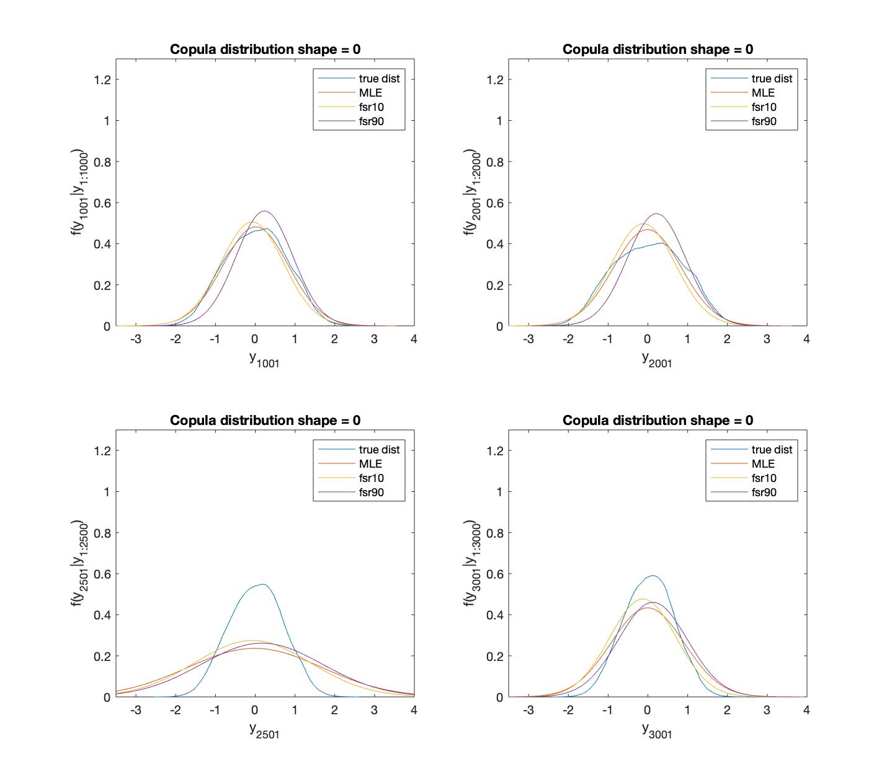
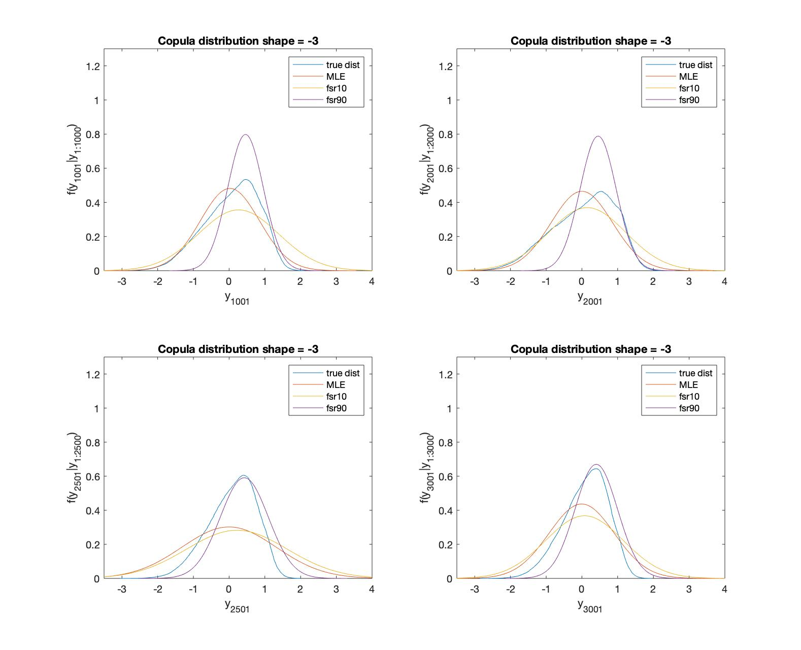
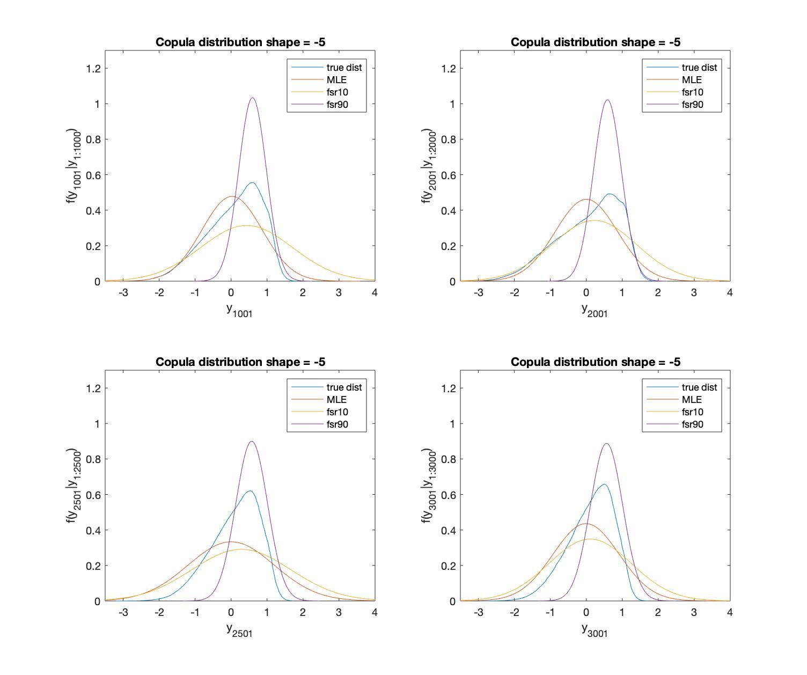
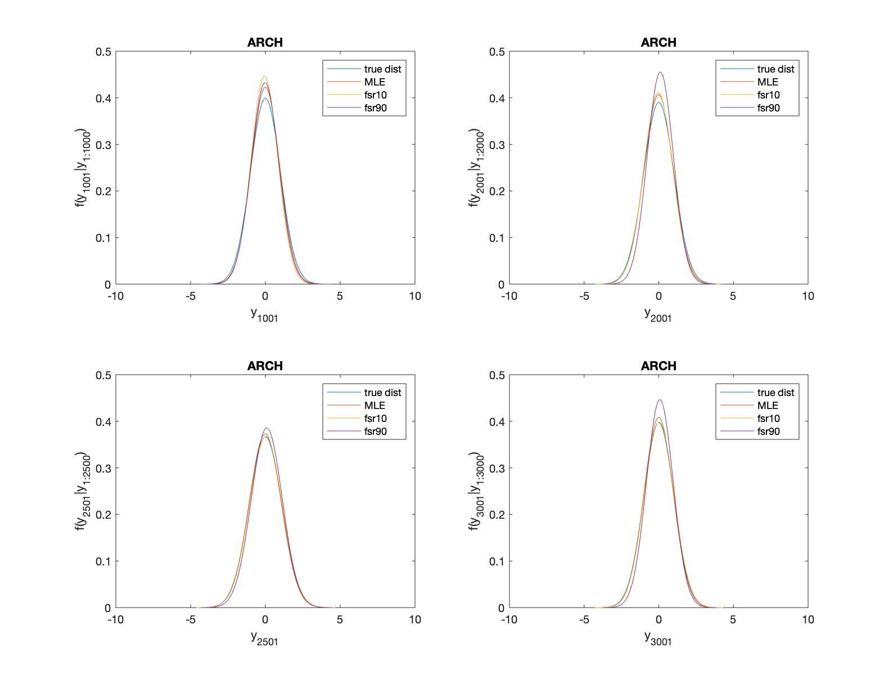
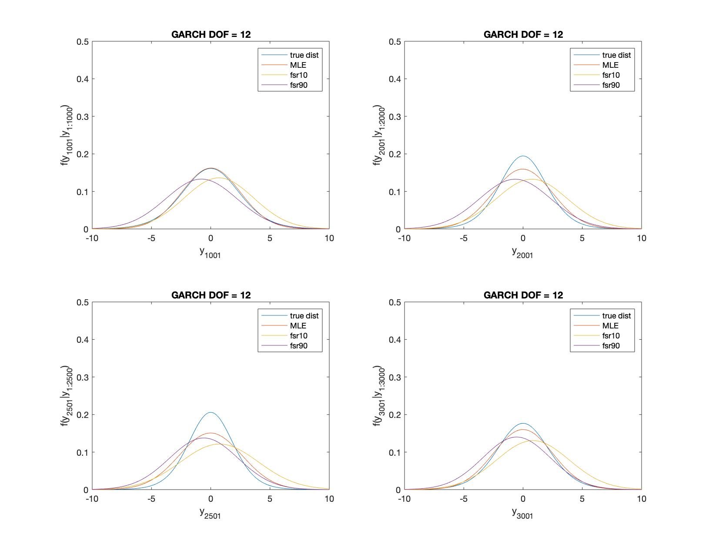
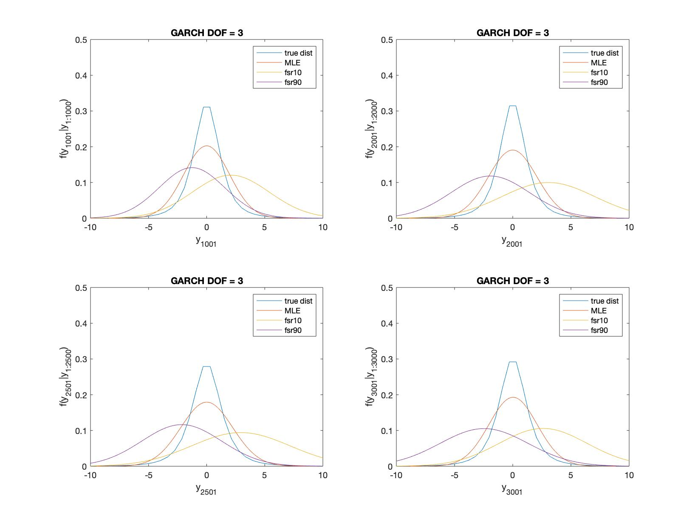

```{r setup, include=FALSE}
knitr::opts_chunk$set(echo = TRUE)
```


```{r, message=FALSE}
library(formattable)
library(dplyr)
library(tidyverse)
library(ggplot2)
library(tsibble)
library(tsibbledata)
library(feasts)
library(normtest)
library(moments)
library(ggthemes)
library(ggpubr)
library(knitr)
library(kableExtra)
```


# Simulation Analysis

## Simulation Design


```{r}
# Editting the matlab written csv files 

GARCH_t12 <- read.csv("GARCH_t12__table.csv")
GARCH_t3 <- read.csv("GARCH_t3_table.csv")
ARCH_table <- read.csv("ARCH_table.csv")

Copula5_table <- read.csv("Copula5_table.csv")
Copula3_table <- read.csv("Copula3_table.csv")
Copula0_table <- read.csv("Copula0_table.csv")

# bold the maximum
max_bold <- formatter("span",style = x~style("font-weight"=ifelse(x == max(x),"bold",NA)))

```

#### Table 1: 

True DGP is ARCH with standard normal errors, assumed DGP is ARCH with standard normal errors 

```{r}
formattable(ARCH_table,list(LS = max_bold,CRPS = max_bold,FSR10 = max_bold,FSR20 = max_bold,FSR80 = max_bold,FSR90 = max_bold))
```

#### Table 2: 

True DGP is GARCH, and error term is t distribution with 3 dof, assumed DGP is ARCH with standard normal errors 

```{r}
formattable(GARCH_t3,list(LS = max_bold,CRPS = max_bold,FSR10 = max_bold,FSR20 = max_bold,FSR80 = max_bold,FSR90 = max_bold))
```

#### Table 3:

True DGP is GARCH, and error term is t distribution with 12 dof, assumed DGP is ARCH with standard normal errors 

```{r}
formattable(GARCH_t12,list(LS = max_bold,CRPS = max_bold,FSR10 = max_bold,FSR20 = max_bold,FSR80 = max_bold,FSR90 = max_bold))
```

#### Table 4:

True DGP is Copula with shape = -5. assumed DGP is ARCH with standard normal errors 

```{r}
formattable(Copula5_table,list(LS = max_bold,CRPS = max_bold,FSR10 = max_bold,FSR20 = max_bold,FSR80 = max_bold,FSR90 = max_bold))
```


#### Table 5:

True DGP is Copula with shape = -3. assumed DGP is ARCH with standard normal errors 

```{r}
formattable(Copula3_table,list(LS = max_bold,CRPS = max_bold,FSR10 = max_bold,FSR20 = max_bold,FSR80 = max_bold,FSR90 = max_bold))
```


#### Table 6:

True DGP is Copula with shape = 0 (no asymmetry). assumed DGP is ARCH with standard normal errors 

```{r}
formattable(Copula0_table,list(LS = max_bold,CRPS = max_bold,FSR10 = max_bold,FSR20 = max_bold,FSR80 = max_bold,FSR90 = max_bold))
```


# Score traces figure

The following graph shows how the average scores keep changing as we change the true data generation processes. The estimated model is kept as ARCH(1) all the time. 

Left column: Score traces for lower tail (10%)

Right column: Score traces for upper tail (90%)

The out-of-sample optimizer is set as FSR10% for lower tail and FSR90% for upper tail. The chosen in-sample optimizers are listed in the graph and highlighted in different colors. 

## GARCH DGP

#### Figure 1


## Copula DGP  

#### Figure 2


# Predictive Probability figures 

## Copula true DGP family 

#### Figure 3



#### Figure 4



#### Figure 5



## GARCH true DGP family

#### Figure 6



#### Figure 7




#### Figure 8



# VaR with simulation data 

Only backtesting VaR for the most misspecified models in each misspecification type. 


### VaR for Copula with shape = -5

#### Table 7

```{r}
copula5var <- read.csv("copula5var.csv")

VaR_0.1 <- as.numeric(copula5var[,c(1,5,9,13,17,21)])
VaR_0.2 <- as.numeric(copula5var[,c(2,6,10,14,18,22)])
VaR_0.8 <- as.numeric(copula5var[,c(3,7,11,15,19,23)])
VaR_0.9 <- as.numeric(copula5var[,c(4,8,12,16,20,24)])

optimizers <- c("LS","CRPS","FSR10","FSR20","FSR80","FSR90")

df <- data.frame(optimizers,VaR_0.1,VaR_0.2,VaR_0.8,VaR_0.9)

max_bold1 <- formatter("span",style=x~style("font-weight"=ifelse(abs(x-0.1)==min(abs(x-0.1)),"bold",NA)))

max_bold2 <- formatter("span",style=x~style("font-weight"=ifelse(abs(x-0.2)==min(abs(x-0.2)),"bold",NA)))

max_bold8 <- formatter("span",style=x~style("font-weight"=ifelse(abs(x-0.8)==min(abs(x-0.8)),"bold",NA)))

max_bold9 <- formatter("span",style=x~style("font-weight"=ifelse(abs(x-0.9)==min(abs(x-0.9)),"bold",NA)))

formattable(df,list(VaR_0.1 = max_bold1,VaR_0.2 = max_bold2,VaR_0.8 = max_bold8,VaR_0.9 = max_bold9))
```

### VaR for GARCH with degree of freedom = 3

#### Table 8

```{r}
garch3var <- read.csv("garch3var.csv")

VaR_0.1 <- as.numeric(garch3var[,c(1,5,9,13,17,21)])
VaR_0.2 <- as.numeric(garch3var[,c(2,6,10,14,18,22)])
VaR_0.8 <- as.numeric(garch3var[,c(3,7,11,15,19,23)])
VaR_0.9 <- as.numeric(garch3var[,c(4,8,12,16,20,24)])

df <- data.frame(optimizers,VaR_0.1,VaR_0.2,VaR_0.8,VaR_0.9)

formattable(df,list(VaR_0.1 = max_bold1,VaR_0.2 = max_bold2,VaR_0.8 = max_bold8,VaR_0.9 = max_bold9))
```


# Empirical Analysis

S&P500 from the U.S. stock markets, with daily trading frequency. The returns are calculated as continuously compounded log returns. 

In order to keep consistent with the simulation example, the sample size is chosen as 6000. 

## Descriptive Statistics 
```{r}
# data cleaning and import 
sp <- read.csv("^GSPC.csv")
sp <- sp %>% dplyr::select("Date","Adj.Close")

sp$log.returns <- c(NA,diff(log(sp$Adj.Close)))
logret <- sp[-c(1:41),c(1,3)] # delete the adjusted price col, only keep 6000 obs

# export the dataset to csv. including only trading days and log returns 
temp <- logret[,c(2)]
temp <- data.frame(temp)
write_csv(temp,"sp500log.csv")
```


```{r, results='hide'}
# descriptive statistics 
summary(logret$log.returns) # ----> need to be tabulated 
range(logret$log.returns)
# some test results aginst normal dist h_null
# JB test
jb.norm.test(logret$log.returns)
# Ljung box test
Box.test(logret$log.returns,lag = 2,type = "Lj",fitdf = 1)

skewness(logret$log.returns)
kurtosis(logret$log.returns)
```

### Summarize Table 

#### Table 9

```{r}
sum <- data.frame(Stock="S&P500",Min=-0.1276522,Median=0.0006105,Mean=0.0002453,Max=0.1095720,Skewness= -0.3807978,Kurtosis=13.5123,JB.Test=27772,LB.Test=60.627)
formattable(sum)
```


### Descriptive Plots

```{r,message=FALSE}

# time series plot
logret$Date <- as.Date(logret$Date,format = "%Y-%m-%d")

logret %>% ggplot(aes(x = Date, y = log.returns)) +
  geom_line()+theme_classic()+labs(x="Year",y="Daily log returns")+
  ggtitle("Figure 9: S&P500 Daily log returns")+
  scale_x_date(date_breaks = "years",date_labels = "%y")+
  scale_y_continuous(labels = scales::percent) + 
  annotate(geom = 'text',x=as.Date("2008-09-18"),y=-0.12,label="Global Financial Crisis",color="red",size=3)+
  annotate(geom = 'text',x=as.Date("2020-04-01"),y=-0.12,label="COVID-19",color="red",size=2)+
  theme_clean()

# histogram plots
logret %>% ggplot()+geom_histogram(aes(x=log.returns))+xlim(-0.13,0.13)+ggtitle("Figure 10")+
  scale_x_continuous(labels = scales::percent)

# ACF plots to see the autocorrelation 
logret <- logret %>% 
  mutate(trading_day = row_number()) %>%
  as_tsibble(index = trading_day,regular = TRUE)

logret %>% ACF((log.returns)^2) %>% autoplot() + ggtitle("Figure 11:Squared log returns autocorrelation")+xlab("number of lags")+ylab("ACF")
```

### Score Tables

#### Table 10

```{r}
sp_table <- read.csv("sp_table.csv")
max_bold <- formatter("span",style = x~style("font-weight"=ifelse(x == max(x),"bold",NA)))

formattable(sp_table,list(LS = max_bold,CRPS = max_bold,FSR10 = max_bold,FSR20 = max_bold,FSR80 = max_bold,FSR90 = max_bold))
```

### Score traces figure 

```{r,fig.width=10,fig.height=5}
# to compress all the calculated plotting average scores together in the same df 
trace_fsr10 <- read.csv("fsr10.csv")
trace_fsr20 <- read.csv("fsr20.csv")
trace_10ls <- read.csv("fsr10_ls.csv")
trace_10crps <- read.csv("fsr10_crps.csv")

fsr10 <- data.frame(trace_fsr10,trace_fsr20,trace_10ls,trace_10crps)

# add back dates to the fsr10 df, initial step = 1000

fsr10 <- fsr10 %>% mutate(Date = logret$Date[1001:6000])

# plot scores --- lower tail 
fsr10$Date <- as.Date(fsr10$Date,format = "%Y-%m-%d")

color1 <- c("FSR10"="red","FSR20"="black","MLE"="purple","CRPS"="green")

fsr10plot <- fsr10 %>% ggplot(aes(x=Date)) +
  geom_line(aes(y = FSR10,color = "FSR10"),size=0.25)+
  geom_line(aes(y = FSR20,color = "FSR20"),size=0.25)+
  geom_line(aes(y = MLE,color = "MLE"),size=0.25)+
  geom_line(aes(y = CRPS,color = "CRPS"),size=0.25)+
  labs(x="Year",y="Average Scores",color="legend")+
  #ggtitle("Figure 12: S&P500 Score traces-lower tail")+
  scale_x_date(date_breaks = "years",date_labels = "%y")+
  scale_color_manual(values = color1)+
  annotate(geom = 'text',x=as.Date("2008-09-18"),y=0.08,label="Global Financial Crisis",color="darkred")+
  theme_clean()
  

# plot scores --- upper tail 
trace_fsr90 <- read.csv("fsr90.csv")
trace_fsr80 <- read.csv("fsr80.csv")
trace_90ls <- read.csv("fsr90_ls.csv")
trace_90crps <- read.csv("fsr90_crps.csv")

fsr90 <- data.frame(trace_fsr90,trace_fsr80,trace_90ls,trace_90crps)

# add back dates to the fsr10 df, initial step = 1000

fsr90 <- fsr90 %>% mutate(Date = logret$Date[1001:6000])

# plot scores --- lower tail 
fsr90$Date <- as.Date(fsr90$Date,format = "%Y-%m-%d")

color2 <- c("FSR90"="red","FSR80"="black","MLE"="purple","CRPS"="green")

fsr90plot <- fsr90 %>% ggplot(aes(x=Date)) +
  geom_line(aes(y = FSR90,color = "FSR90"),size=0.25)+
  geom_line(aes(y = FSR80,color = "FSR80"),size=0.25)+
  geom_line(aes(y = MLE,color = "MLE"),size=0.25)+
  geom_line(aes(y = CRPS,color = "CRPS"),size=0.25)+
  labs(x="Year",y="",color="legend")+
  #ggtitle("Figure 12: S&P500 Score traces-upper tail")+
  scale_x_date(date_breaks = "years",date_labels = "%y")+
  scale_color_manual(values = color2)+
  annotate(geom = 'text',x=as.Date("2008-09-18"),y=-0.05,label="Global Financial Crisis",color="darkred")+
  theme_clean()
  
# put two plots side by side 
ggarrange(fsr10plot,fsr90plot,ncol=2,legend = "bottom",labels = c("Figure 12(a) Lower Tail","Figure 12(b) Upper Tail"))

```


### VaR for S&P500

#### Table 11: Before 2008 GFC

```{r}
spvar <- read.csv("spvar1_table.csv")

VaR_0.1 <- as.numeric(spvar[,c(1,5,9,13,17,21)])
VaR_0.2 <- as.numeric(spvar[,c(2,6,10,14,18,22)])
VaR_0.8 <- as.numeric(spvar[,c(3,7,11,15,19,23)])
VaR_0.9 <- as.numeric(spvar[,c(4,8,12,16,20,24)])

df <- data.frame(optimizers,VaR_0.1,VaR_0.2,VaR_0.8,VaR_0.9)

formattable(df,list(VaR_0.1 = max_bold1,VaR_0.2 = max_bold2,VaR_0.8 = max_bold8,VaR_0.9 = max_bold9))
```

#### Table 12: After 2008 GFC

```{r}
spvar <- read.csv("spvar2_table.csv")
spvar <- round(spvar,digits = 4)

VaR_0.1 <- as.numeric(spvar[,c(1,5,9,13,17,21)])
VaR_0.2 <- as.numeric(spvar[,c(2,6,10,14,18,22)])
VaR_0.8 <- as.numeric(spvar[,c(3,7,11,15,19,23)])
VaR_0.9 <- as.numeric(spvar[,c(4,8,12,16,20,24)])

df <- data.frame(optimizers,VaR_0.1,VaR_0.2,VaR_0.8,VaR_0.9)

formattable(df,list(VaR_0.1 = max_bold1,VaR_0.2 = max_bold2,VaR_0.8 = max_bold8,VaR_0.9 = max_bold9))
```

