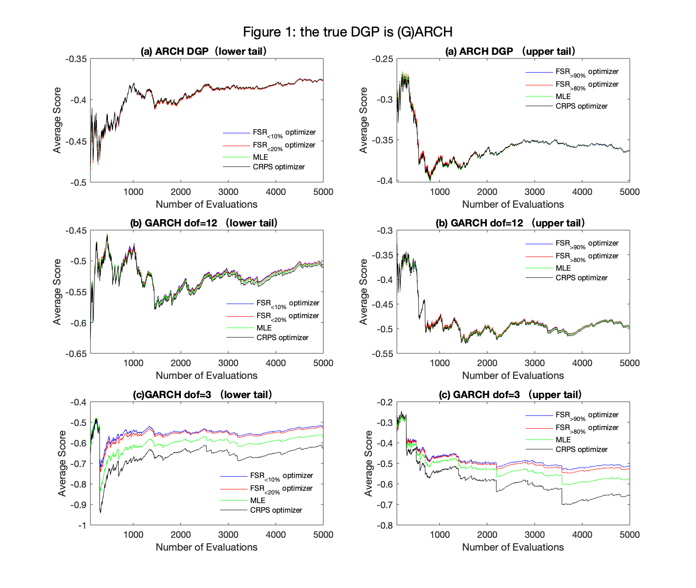
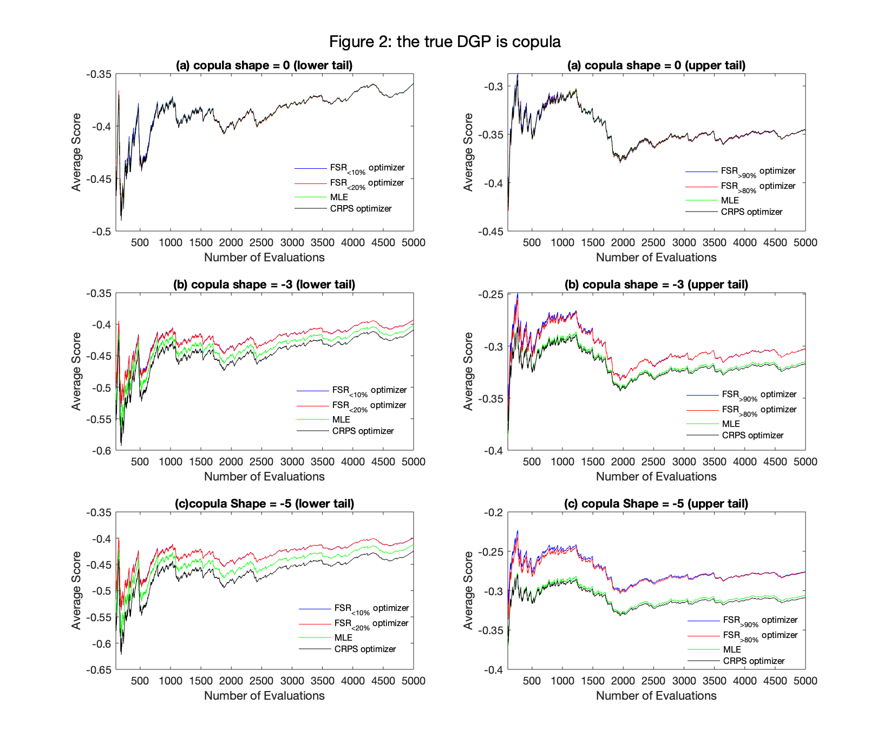

```{r setup, include=FALSE}
knitr::opts_chunk$set(
  echo = FALSE,
  eval = TRUE,
  message = FALSE,
  warning = FALSE)
```


## Abstract 

With correct model specification being an ongoing issue for conventional likelihood-based prediction, scoring rules have been used to produce forecasts that are accurate – in a well-defined sense - in the presence of this misspecification. Based on previous research on this topic, this paper conducts both numerical and empirical analyses to explore the impact of the form and degree of model misspecification on probabilistic forecasts that are optimal under a given score. In particular, the role of optimal forecasts in predicting Value-at-Risk and the VIX Volatility Index, and in optimizing portfolio allocation, is to be investigated. 


Results at the current stage have shown that the greater the degree of model misspecification is, the more beneficial is optimal prediction. Empirical analysis shows that after the global financial crisis, predictions that are optimal according to a censored scoring rule that rewards predictive accuracy in a tail are substantially more accurate than the alternatives, including likelihood-based predictions. This indicates the potentially significant contribution to financial analyses of this method.
 

## 1. Introduction

This research paper will explore the question: ‘When do optimal probabilistic forecasts work’; with particular attention given to the usefulness of optimal predictions in financial markets. This work builds on recent research on this topic by Loaiza-Maya et al. (2020). Correct model specification is a challenge in forecasting, especially for likelihood-based predictions since, in practice, the assumed model underpinning the likelihood function will almost certainly differ from the unknown true data generation process (DGP). As an alternative to likelihood-based prediction, scoring rules have recently been proposed as a basis for producing probabilistic forecasts that perform well according to that score, even in the presence of model misspecification; see Loaiza-Maya, Martin & Frazier (2019) and Loaiza-Maya et al. (2020). 


The ‘optimal’ probabilistic forecast discussed in this paper will refer to a predictive probability distribution that is optimal according to a user- specified scoring rule. In particular, this paper seeks to document the effects of the form and degree of model misspecification on optimal forecast performance using data simulated from the (generalized) autoregressive conditional heteroscedasticity ((G)ARCH) and copula models. The assumed predictive model is fixed as ARCH (1) for both the simulation and empirical analyses. Motivated by the practical usage of predictive distributions in financial analyses, this paper will assess optimal forecast performance in Value-at-Risk (VaR), the Volatility Index (VIX) and portfolio optimization applications, using empirical data extending over a period of time that precedes the global financial crisis (GFC) and extends to the latest period in which COVID-19 has impacted on financial markets. The empirical results are expected to make contributions to existing financial analyses of risks and returns.


## 2. Research aims and questions

This research paper aims to discover whether optimal prediction performs the same under varying degrees of misspecification of the true DGP in simulation experiments; specifically as the true DGP is varied from Gaussian ARCH(1), to Gaussian GARCH(1,1), to GARCH(1,1) with marginal skewness introduced by inversion copula, whilst the assumed predictive model remains fixed at Gaussian ARCH(1).


The paper also aims to show how optimal prediction performs in different financial market situations with the empirical data used in this research covering two important periods in financial markets, namely the GFC and the COVID-19 pandemic.


## 3. Literature review

Scoring rules can be used to estimate parameters and to evaluate probabilistic forecasts. A variety of proper scoring rules allows users to produce probability predictions based on their interests, and to compare these predictions, as long as they refer to the same forecast quantity. Some commonly used scoring roles are discussed in Gneiting & Raftery (2007), such as the logarithmic score (LS) and the continuously ranked probability score (CRPS). Similarly, Diks, Panchenko & van Dijk, (2011) introduce the censored likelihood score (CSL), which focuses on any probability regions of interest to the user, including the tails of the predictive distribution.


Loaiza-Maya, Martin & Frazier, (2019) introduce scoring rules to Bayesian prediction as an alternative to using the conventional likelihood function for updating the prior probability. They conduct both numerical and empirical analyses using the scoring rules mentioned above and show that the degree of model misspecification plays an important role in terms of how the ‘Focused’ Bayesian method performs relative to misspecified likelihood-based predictions. 


Loaiza-Maya et al., (2020) extend the above discussion to frequentist probability forecasting. They address questions about when we can/cannot benefit from optimal probabilistic forecasts out of sample and introduce the concepts of ‘coherence’ and ‘strict coherence’. In short, coherence means when the optimal probabilistic forecast based on a given score is superior, or at least performs the same as, alternative forecasts according to the same score. Strict coherence is when the optimal prediction is strictly preferable given that score.


To continue the research in this vein, my paper will mainly be guided by Loaiza-Maya et al., (2020) and Loaiza- Maya, Martin & Frazier, (2019). Three specific applications of optimal prediction will be conducted and I will further explore the impact of model misspecification on optimal prediction as the true DGP changes in particular ways.


## 4. Numerical investigation

### 4.1 Simulation experiments design

The purpose of this simulation is to mimic the behavior of financial returns and volatility and to discover how optimal probabilistic forecasts perform under different forms and degrees of model misspecification. GARCH models capture the volatility clustering and serial dependence, and the negative marginal skewness will be introduced using an inversion copula with degree of skewness controlled by the shape parameter.


The methodology in Loaiza-Maya et al., (2020) and Loaiza-Maya, Martin & Frazier, (2019) is adopted here, with specific simulation scenarios listed as follows ($t_{\nu}$ indicates a Student-t distribution with $\nu$ degrees of freedom):

```{r, out.width="600px",fig.align='center'}
knitr::include_graphics("Picture 1.png")
```


We conduct each simulation scenario as follows (Loaiza-Maya et al., 2020): 

  1.	Generate T = 6000 observations for $y_t$ from the true DGP
  
  2.	Use $y_{1:1000}$ to estimate $\hat \theta$ in the assumed predictive model based on the positively-oriented score $S_i$

$${\hat \theta^{[i]}}:=arg\max_{\theta \in \Theta}\bar S_i({\theta})---(1)$$  
$$\bar S_i(\theta):=\frac{1}{T-(\tau+1)}\sum^{T-\tau}_{t=2}S(P_{\theta}^{t-1},y_t)---(2)$$

  3.	Produce the one-step-ahead predictive $P^{t-1}_{\hat \theta_1^{[i]}}$ And compute the out-of-sample score using $S_j$, where $S_i$ and $S_j$ refer to (3)(4)(5)


$$S_{LS}(P_{\theta}^{t-1},y_t)=lnp(y_t|\mathscr{F}_{t-1},\theta) ---(3)$$

$$S_{CRPS}(P_{\theta}^{t-1},y_t)=-\int_{-\infty}^{+\infty}[P(y|\mathscr{F}_{t-1},\theta)-I(y \ge y_t)]^2dy ---(4)$$

$$S_{CLS}(P_{\theta}^{t-1},y_t)=lnp(y_t|\mathscr{F}_{t-1},\theta)I(y_t \in A)+[ln\int_{A^c}p(y|\mathscr{F}_{t-1},\theta)dy]I(y_t \in A^c) --- (5)$$

  4.	Expand estimation window by one observation and repeat step 2-3 $\tau = T-1000$ times and compute:

$$\bar S_j(\hat \theta^{[i]})=\frac{1}{\tau}\sum^T_{t=T-{\tau}+1}S_j (P^{t-1}_{\hat \theta_1^{[i]}},y_t) --- (6)$$


#### 4.1.1 Simulation analysis: preliminary results 

##### Average Scores

Results of Table 1-3 are recorded for scenario (i) and Table 4-6 are for scenario (ii) with degree of model misspecification listed in an ascending order. The first column shows $S_i$ that we used to produce predictions and the first row shows $S_j$. The bolded value(s) is the largest one(s) in each column, indicating the optimal prediction(s) based on this score. 

In Table 1 and 4, the least misspecified cases, we observe the same predictive accuracy according to a given score when different scoring rules are used to produce predictions such as values in column 5. While in the most misspecified cases (Table 3 and 6), we improve the predictive accuracy by using scoring rules. The results in Table 1-6, then illustrate that we can gain more from optimal prediction according to a given score when the degree of model misspecification is greater. It is true for both types of model misspecification.

```{r, message=FALSE}
#library(formattable)
library(dplyr)
library(tidyverse)
library(ggplot2)
library(tsibble)
library(tsibbledata)
library(feasts)
library(normtest)
library(moments)
library(ggthemes)
library(ggpubr)
library(knitr)
library(kableExtra)
```

```{r}
# Editting the matlab written csv files 

GARCH_t12 <- read.csv("GARCH_t12__table.csv")
GARCH_t12 <- rename(GARCH_t12, "In-sample optimizers" = Row, "FSR 10%" = FSR10, "FSR 20%"=FSR20, "FSR 80%"=FSR80,"FSR 90%"=FSR90)
GARCH_t12$`In-sample optimizers`<-c("LS","CRPS","FSR 10%","FSR 20%","FSR 80%","FSR 90%")

GARCH_t3 <- read.csv("GARCH_t3_table.csv")
GARCH_t3 <- rename(GARCH_t3, "In-sample optimizers" = Row, "FSR 10%" = FSR10, "FSR 20%"=FSR20, "FSR 80%"=FSR80,"FSR 90%"=FSR90)
GARCH_t3$`In-sample optimizers`<-c("LS","CRPS","FSR 10%","FSR 20%","FSR 80%","FSR 90%")

ARCH_table <- read.csv("ARCH_table.csv")
ARCH_table <- rename(ARCH_table, "In-sample optimizers" = Row, "FSR 10%" = FSR10, "FSR 20%"=FSR20, "FSR 80%"=FSR80,"FSR 90%"=FSR90)
ARCH_table$`In-sample optimizers`<-c("LS","CRPS","FSR 10%","FSR 20%","FSR 80%","FSR 90%")

Copula5_table <- read.csv("Copula5_table.csv")
Copula5_table <- rename(Copula5_table, "In-sample optimizers" = Row, "FSR 10%" = FSR10, "FSR 20%"=FSR20, "FSR 80%"=FSR80,"FSR 90%"=FSR90)
Copula5_table$`In-sample optimizers`<-c("LS","CRPS","FSR 10%","FSR 20%","FSR 80%","FSR 90%")

Copula3_table <- read.csv("Copula3_table.csv")
Copula3_table <- rename(Copula3_table, "In-sample optimizers" = Row, "FSR 10%" = FSR10, "FSR 20%"=FSR20, "FSR 80%"=FSR80,"FSR 90%"=FSR90)
Copula3_table$`In-sample optimizers`<-c("LS","CRPS","FSR 10%","FSR 20%","FSR 80%","FSR 90%")

Copula0_table <- read.csv("Copula0_table.csv")
Copula0_table <- rename(Copula0_table, "In-sample optimizers" = Row, "FSR 10%" = FSR10, "FSR 20%"=FSR20, "FSR 80%"=FSR80,"FSR 90%"=FSR90)
Copula0_table$`In-sample optimizers`<-c("LS","CRPS","FSR 10%","FSR 20%","FSR 80%","FSR 90%")

```


```{r}
ARCH_table %>% 
  mutate(
    LS = cell_spec(format(LS,4),"html",bold = ifelse(LS == max(LS),TRUE,FALSE)),
    CRPS = cell_spec(format(CRPS,4),"html",bold = ifelse(CRPS==max(CRPS),TRUE,FALSE)),
    `FSR 10%` = cell_spec(format(`FSR 10%`,4),"html",bold = ifelse(`FSR 10%`==max(`FSR 10%`),TRUE,FALSE)),
    `FSR 20%` = cell_spec(format(`FSR 20%`,4),"html",bold = ifelse(`FSR 20%`==max(`FSR 20%`),TRUE,FALSE)),
    `FSR 80%` = cell_spec(format(`FSR 80%`,4),"html",bold = ifelse(`FSR 80%`==max(`FSR 80%`),TRUE,FALSE)),
    `FSR 90%` = cell_spec(format(`FSR 90%`,4),"html",bold = ifelse(`FSR 90%`==max(`FSR 90%`),TRUE,FALSE))
  ) %>%
  kable("html",escape = F) %>%
  kable_styling("bordered",full_width = F)%>%
  add_header_above(c("","Average out-of-sample scores"=6)) %>% 
  add_header_above(c("Table 1: the true DGP is ARCH(1)"=7))
```

```{r}
GARCH_t12 %>% 
  mutate(
    LS = cell_spec(format(LS,4),"html",bold = ifelse(LS == max(LS),TRUE,FALSE)),
    CRPS = cell_spec(format(CRPS,4),"html",bold = ifelse(CRPS==max(CRPS),TRUE,FALSE)),
    `FSR 10%` = cell_spec(format(`FSR 10%`,4),"html",bold = ifelse(`FSR 10%`==max(`FSR 10%`),TRUE,FALSE)),
    `FSR 20%` = cell_spec(format(`FSR 20%`,4),"html",bold = ifelse(`FSR 20%`==max(`FSR 20%`),TRUE,FALSE)),
    `FSR 80%` = cell_spec(format(`FSR 80%`,4),"html",bold = ifelse(`FSR 80%`==max(`FSR 80%`),TRUE,FALSE)),
    `FSR 90%` = cell_spec(format(`FSR 90%`,4),"html",bold = ifelse(`FSR 90%`==max(`FSR 90%`),TRUE,FALSE))
  ) %>%
  kable("html",escape = F) %>%
  kable_styling("bordered",full_width = F)%>%
  add_header_above(c("","Average out-of-sample scores"=6)) %>% 
  add_header_above(c("Table 2: the true DGP is GARCH(1,1) with degree of freedom = 12"=7))
```


```{r}
GARCH_t3 %>% 
  mutate(
    LS = cell_spec(format(LS,4),"html",bold = ifelse(LS == max(LS),TRUE,FALSE)),
    CRPS = cell_spec(format(CRPS,4),"html",bold = ifelse(CRPS==max(CRPS),TRUE,FALSE)),
    `FSR 10%` = cell_spec(format(`FSR 10%`,4),"html",bold = ifelse(`FSR 10%`==max(`FSR 10%`),TRUE,FALSE)),
    `FSR 20%` = cell_spec(format(`FSR 20%`,4),"html",bold = ifelse(`FSR 20%`==max(`FSR 20%`),TRUE,FALSE)),
    `FSR 80%` = cell_spec(format(`FSR 80%`,4),"html",bold = ifelse(`FSR 80%`==max(`FSR 80%`),TRUE,FALSE)),
    `FSR 90%` = cell_spec(format(`FSR 90%`,4),"html",bold = ifelse(`FSR 90%`==max(`FSR 90%`),TRUE,FALSE))
  ) %>%
  kable("html",escape = F) %>%
  kable_styling("bordered",full_width = F)%>%
  add_header_above(c("","Average out-of-sample scores"=6)) %>% 
  add_header_above(c("Table 3: the true DGP is GARCH(1,1) with degree of freedom = 3"=7))
```


```{r}

Copula0_table %>% 
  mutate(
    LS = cell_spec(format(LS,4),"html",bold = ifelse(LS == max(LS),TRUE,FALSE)),
    CRPS = cell_spec(format(CRPS,4),"html",bold = ifelse(CRPS==max(CRPS),TRUE,FALSE)),
    `FSR 10%` = cell_spec(format(`FSR 10%`,4),"html",bold = ifelse(`FSR 10%`==max(`FSR 10%`),TRUE,FALSE)),
    `FSR 20%` = cell_spec(format(`FSR 20%`,4),"html",bold = ifelse(`FSR 20%`==max(`FSR 20%`),TRUE,FALSE)),
    `FSR 80%` = cell_spec(format(`FSR 80%`,4),"html",bold = ifelse(`FSR 80%`==max(`FSR 80%`),TRUE,FALSE)),
    `FSR 90%` = cell_spec(format(`FSR 90%`,4),"html",bold = ifelse(`FSR 90%`==max(`FSR 90%`),TRUE,FALSE))
  ) %>%
  kable("html",escape = F) %>%
  kable_styling("bordered",full_width = F)%>%
  add_header_above(c("","Average out-of-sample scores"=6)) %>% 
  add_header_above(c("Table 4: the true DGP is copula with shape parameter = 0"=7))
```


```{r}
Copula3_table %>% 
  mutate(
    LS = cell_spec(format(LS,4),"html",bold = ifelse(LS == max(LS),TRUE,FALSE)),
    CRPS = cell_spec(format(CRPS,4),"html",bold = ifelse(CRPS==max(CRPS),TRUE,FALSE)),
    `FSR 10%` = cell_spec(format(`FSR 10%`,4),"html",bold = ifelse(`FSR 10%`==max(`FSR 10%`),TRUE,FALSE)),
    `FSR 20%` = cell_spec(format(`FSR 20%`,4),"html",bold = ifelse(`FSR 20%`==max(`FSR 20%`),TRUE,FALSE)),
    `FSR 80%` = cell_spec(format(`FSR 80%`,4),"html",bold = ifelse(`FSR 80%`==max(`FSR 80%`),TRUE,FALSE)),
    `FSR 90%` = cell_spec(format(`FSR 90%`,4),"html",bold = ifelse(`FSR 90%`==max(`FSR 90%`),TRUE,FALSE))
  ) %>%
  kable("html",escape = F) %>%
  kable_styling("bordered",full_width = F)%>%
  add_header_above(c("","Average out-of-sample scores"=6)) %>% 
  add_header_above(c("Table 5: the true DGP is copula with shape parameter = -3"=7))
```


```{r}
Copula5_table %>% 
  mutate(
    LS = cell_spec(format(LS,4),"html",bold = ifelse(LS == max(LS),TRUE,FALSE)),
    CRPS = cell_spec(format(CRPS,4),"html",bold = ifelse(CRPS==max(CRPS),TRUE,FALSE)),
    `FSR 10%` = cell_spec(format(`FSR 10%`,4),"html",bold = ifelse(`FSR 10%`==max(`FSR 10%`),TRUE,FALSE)),
    `FSR 20%` = cell_spec(format(`FSR 20%`,4),"html",bold = ifelse(`FSR 20%`==max(`FSR 20%`),TRUE,FALSE)),
    `FSR 80%` = cell_spec(format(`FSR 80%`,4),"html",bold = ifelse(`FSR 80%`==max(`FSR 80%`),TRUE,FALSE)),
    `FSR 90%` = cell_spec(format(`FSR 90%`,4),"html",bold = ifelse(`FSR 90%`==max(`FSR 90%`),TRUE,FALSE))
  ) %>%
  kable("html",escape = F) %>%
  kable_styling("bordered",full_width = F)%>%
  add_header_above(c("","Average out-of-sample scores"=6)) %>% 
  add_header_above(c("Table 6: the true DGP is copula with shape parameter = -5"=7))
```


##### Score traces

The above tables show the average scores at the end of evaluations, while score trace figures demonstrate how these average scores change through the whole evaluation process. The left panel shows how listed scores perform in terms of forecasting 10% tail of the true distribution and the right panel illustrates the performance of scores in 90% tail. The least misspecified case is the first row and the last row is the most misspecified case. The figures show that we can benefit more from using FSR in terms of improving accuracy of predicting tails in both forms when the degree of model misspecification is larger. 


```{r, out.width="600px",fig.align='center'}

```

```{r, out.width="600px",fig.align='center'}

```

## 5. Empirical investigation

### 5.1 Empirical analysis design

The design of empirical analysis closely follows the simulation experiments. That is, we only change the simulated true DGP to the continuously compounded logarithmic returns of S&P500 over a time period that precedes the GFC and extends to the latest period in which COVID-19 has impacts on financial market. 


#### 5.1.1 Empirical analysis: preliminary results 

##### Descriptive statistics

```{r}
# data cleaning and import 
sp <- read.csv("^GSPC.csv")
sp <- sp %>% dplyr::select("Date","Adj.Close")

sp$log.returns <- c(NA,diff(log(sp$Adj.Close)))
logret <- sp[-c(1:41),c(1,3)] # delete the adjusted price col, only keep 6000 obs

# export the dataset to csv. including only trading days and log returns 
temp <- logret[,c(2)]
temp <- data.frame(temp)
write_csv(temp,"sp500log.csv")
```


```{r, results='hide'}
# descriptive statistics 
summary(logret$log.returns) # ----> need to be tabulated 
range(logret$log.returns)
# some test results aginst normal dist h_null
# JB test
jb.norm.test(logret$log.returns)
# Ljung box test
Box.test(logret$log.returns,lag = 2,type = "Lj",fitdf = 1)

skewness(logret$log.returns)
kurtosis(logret$log.returns)
```


```{r}
sum <- data.frame(Stock="S&P500",Min=-0.1276522,Median=0.0006105,Mean=0.0002453,Max=0.1095720,Skewness= -0.3807978,Kurtosis=13.5123,JB.Test=27772,LB.Test=60.627)
formattable(sum)
```


```{r,message=FALSE,fig.align='center'}

# time series plot
logret$Date <- as.Date(logret$Date,format = "%Y-%m-%d")

logret %>% ggplot(aes(x = Date, y = log.returns)) +
  geom_line()+theme_classic()+labs(x="Year",y="Daily log returns")+
  ggtitle("Figure 9: S&P500 daily log returns")+
  scale_x_date(date_breaks = "years",date_labels = "%y")+
  scale_y_continuous(labels = scales::percent) + 
  annotate(geom = 'text',x=as.Date("2008-09-18"),y=-0.12,label="Global Financial Crisis",color="red",size=3)+
  annotate(geom = 'text',x=as.Date("2020-04-01"),y=-0.12,label="COVID-19",color="red",size=2)+
  theme_clean()+
  labs(caption = "Figure 9: the time series plot of S&P500 daily log returns")

# histogram plots
logret %>% ggplot()+geom_histogram(aes(x=log.returns))+xlim(-0.13,0.13)+ggtitle("Figure 10")+
  scale_x_continuous(labels = scales::percent)+theme_clean()+
  labs(caption = "Figure 10: the distribution of S&P500 log returns is asymmetric")

# ACF plots to see the autocorrelation 
logret <- logret %>% 
  mutate(trading_day = row_number()) %>%
  as_tsibble(index = trading_day,regular = TRUE)

logret %>% ACF((log.returns)^2) %>% autoplot() + ggtitle("Figure 11:Squared log returns autocorrelation")+xlab("number of lags")+ylab("ACF")+theme_clean()+labs(caption = "Figure 11: the autocorrelation plot shows there is a strong serial correlation in volatility of S&P500")
```

##### Average scores 

```{r}
sp_table <- read.csv("sp_table.csv")
sp_table <- rename(sp_table, "In-sample optimizers" = Row,"FSR 10%" = FSR10, "FSR 20%"=FSR20, "FSR 80%"=FSR80,"FSR 90%"=FSR90)
sp_table$`In-sample optimizers`<-c("LS","CRPS","FSR 10%","FSR 20%","FSR 80%","FSR 90%")

sp_table %>% 
  mutate(
    LS = cell_spec(format(LS,4),"html",bold = ifelse(LS == max(LS),TRUE,FALSE)),
    CRPS = cell_spec(format(CRPS,4),"html",bold = ifelse(CRPS==max(CRPS),TRUE,FALSE)),
    `FSR 10%` = cell_spec(format(`FSR 10%`,4),"html",bold = ifelse(`FSR 10%`==max(`FSR 10%`),TRUE,FALSE)),
    `FSR 20%` = cell_spec(format(`FSR 20%`,4),"html",bold = ifelse(`FSR 20%`==max(`FSR 20%`),TRUE,FALSE)),
    `FSR 80%` = cell_spec(format(`FSR 80%`,4),"html",bold = ifelse(`FSR 80%`==max(`FSR 80%`),TRUE,FALSE)),
    `FSR 90%` = cell_spec(format(`FSR 90%`,4),"html",bold = ifelse(`FSR 90%`==max(`FSR 90%`),TRUE,FALSE))
  ) %>%
  kable("html",escape = F) %>%
  kable_styling("bordered",full_width = F)%>%
  add_header_above(c("","Average out-of-sample scores"=6)) %>% 
  add_header_above(c("Table 9: Average scores for S&P500"=7))
```

The average score table, similar to simulation analysis, is produced for daily logarithmic returns of S&P500. For example, in column 4 (FSR 10%), a focused score at 10% will produce the optimal prediction in terms of forecasting the 10% tail of the returns’ distribution. The results in this table indicate that we expect to gain considerably from optimal probabilistic forecasts in practice. 

##### Score traces 

```{r,fig.width=10,fig.height=5}
# to compress all the calculated plotting average scores together in the same df 
trace_fsr10 <- read.csv("fsr10.csv")
trace_fsr20 <- read.csv("fsr20.csv")
trace_10ls <- read.csv("fsr10_ls.csv")
trace_10crps <- read.csv("fsr10_crps.csv")

fsr10 <- data.frame(trace_fsr10,trace_fsr20,trace_10ls,trace_10crps)

# add back dates to the fsr10 df, initial step = 1000

fsr10 <- fsr10 %>% mutate(Date = logret$Date[1001:6000])

# plot scores --- lower tail 
fsr10$Date <- as.Date(fsr10$Date,format = "%Y-%m-%d")

color1 <- c("FSR10"="red","FSR20"="black","MLE"="purple","CRPS"="green")

fsr10plot <- fsr10 %>% ggplot(aes(x=Date)) +
  geom_line(aes(y = FSR10,color = "FSR10"),size=0.25)+
  geom_line(aes(y = FSR20,color = "FSR20"),size=0.25)+
  geom_line(aes(y = MLE,color = "MLE"),size=0.25)+
  geom_line(aes(y = CRPS,color = "CRPS"),size=0.25)+
  labs(x="Year",y="Average Scores",color="legend")+
  #ggtitle("Figure 12: S&P500 Score traces-lower tail")+
  scale_x_date(date_breaks = "years",date_labels = "%y")+
  scale_color_manual(values = color1)+
  annotate(geom = 'text',x=as.Date("2008-09-18"),y=0.08,label="Global Financial Crisis",color="darkred")+
  theme_clean()
  

# plot scores --- upper tail 
trace_fsr90 <- read.csv("fsr90.csv")
trace_fsr80 <- read.csv("fsr80.csv")
trace_90ls <- read.csv("fsr90_ls.csv")
trace_90crps <- read.csv("fsr90_crps.csv")

fsr90 <- data.frame(trace_fsr90,trace_fsr80,trace_90ls,trace_90crps)

# add back dates to the fsr10 df, initial step = 1000

fsr90 <- fsr90 %>% mutate(Date = logret$Date[1001:6000])

# plot scores --- lower tail 
fsr90$Date <- as.Date(fsr90$Date,format = "%Y-%m-%d")

color2 <- c("FSR90"="red","FSR80"="black","MLE"="purple","CRPS"="green")

fsr90plot <- fsr90 %>% ggplot(aes(x=Date)) +
  geom_line(aes(y = FSR90,color = "FSR90"),size=0.25)+
  geom_line(aes(y = FSR80,color = "FSR80"),size=0.25)+
  geom_line(aes(y = MLE,color = "MLE"),size=0.25)+
  geom_line(aes(y = CRPS,color = "CRPS"),size=0.25)+
  labs(x="Year",y="",color="legend")+
  #ggtitle("Figure 12: S&P500 Score traces-upper tail")+
  scale_x_date(date_breaks = "years",date_labels = "%y")+
  scale_color_manual(values = color2)+
  annotate(geom = 'text',x=as.Date("2008-09-18"),y=-0.05,label="Global Financial Crisis",color="darkred")+
  theme_clean()
  
# put two plots side by side 
ggarrange(fsr10plot,fsr90plot,ncol=2,legend = "bottom",labels = c("Figure 12(a) Lower Tail","Figure 12(b) Upper Tail"))

```


The score traces illustrate a very interesting phenomenon. The FSR focused on the 10% and 90% tails are strictly superior to alternative forecasts produced by other scores after the GFC and continue to perform well until the very recent date. It indicates that optimal probabilistic forecasts might predict financial markets better in and after times of stock market turbulance, which could represent a great contribution to the existing financial analyses of risks and returns. 


## 6. Timeline

```{r, out.width="600px",fig.align='center'}
knitr::include_graphics("timeline.png")
```


## References 

Diks, C., Panchenko, V., & van Dijk, D. (2011). Likelihood-based scoring rules for comparing density forecasts in tails. Journal of Econometrics, 163(2), 215-230. doi: 10.1016/j.jeconom.2011.04.001


Gneiting, T., & Raftery, A. (2007). Strictly Proper Scoring Rules, Prediction, and Estimation. Journal of the American Statistical Association, 102(477), 359-378. doi: 10.1198/016214506000001437


Loaiza-Maya, R., Martin, G., & Frazier, D. (2019). Focused Bayesian Prediction. Retrieved from http://arxiv.org/abs/1912.12571


Loaiza-Maya, et al. (2020). Optimal Probabilistic Forecasts: when do they work? Manuscript in preparation. 


## VIX analysis 

```{r,message=F}
# data cleaning and import 
vix <- read.csv("^VIX.csv")
vix <- vix %>% dplyr::select("Date","Adj.Close")

vix$logvix <- log(vix$Adj.Close)

# previous day log vix values
prev <- matrix(0,nrow = nrow(vix)+1,ncol = 1)
for (i in 1:nrow(vix)){
  prev[1,1] <- c("NA")
  prev[i+1,1] <- vix$logvix[i]
}
prev <- as.data.frame(prev)
prev <- prev[-c(1:178,6179),1]

# need to be very careful about the time index -- dependent variable starting with t+1
MA5 <- matrix(0,nrow=nrow(vix)-5,ncol = 1)
for (i in 1:(nrow(vix)-5)){
  sum = 0
  for (j in 1:5){
    sum = sum + vix$logvix[i+j-1]
  }
  MA5[i,1] = (1/5)*sum
}

MA22 <- matrix(0,nrow = nrow(vix)-22,ncol = 1)
for (i in 1:(nrow(vix)-22)){
  sum = 0
  for (j in 1:22){
    sum = sum + vix$logvix[i+j-1]
  }
  MA22[i,1] = (1/22)*sum
}


#require(zoo)
#MA5 <- rollmean(vix$logvix,5,align = "center")
MA5 <- as.data.frame(MA5) # average of past week
MA5 <- MA5[-c(1:173),1] # including only 6000 obs 

#MA22 <- rollmean(vix$logvix,22,align = "center")
MA22 <- as.data.frame(MA22) # average of past month
MA22 <- MA22[-c(1:156),1] # including only 6000 obs

logvix <- vix[-c(1:178),c(1,3)] # delete the adjusted vix col, only keep 6000 obs
logvix <- cbind(logvix,prev,MA5,MA22)
# export the dataset to csv. including only trading days and log returns 
temp <- logvix[,2:5]
write_csv(temp,"vixlog.csv")
# the logvix, previous log vix and moving average values have the same length in the final file. 
```


